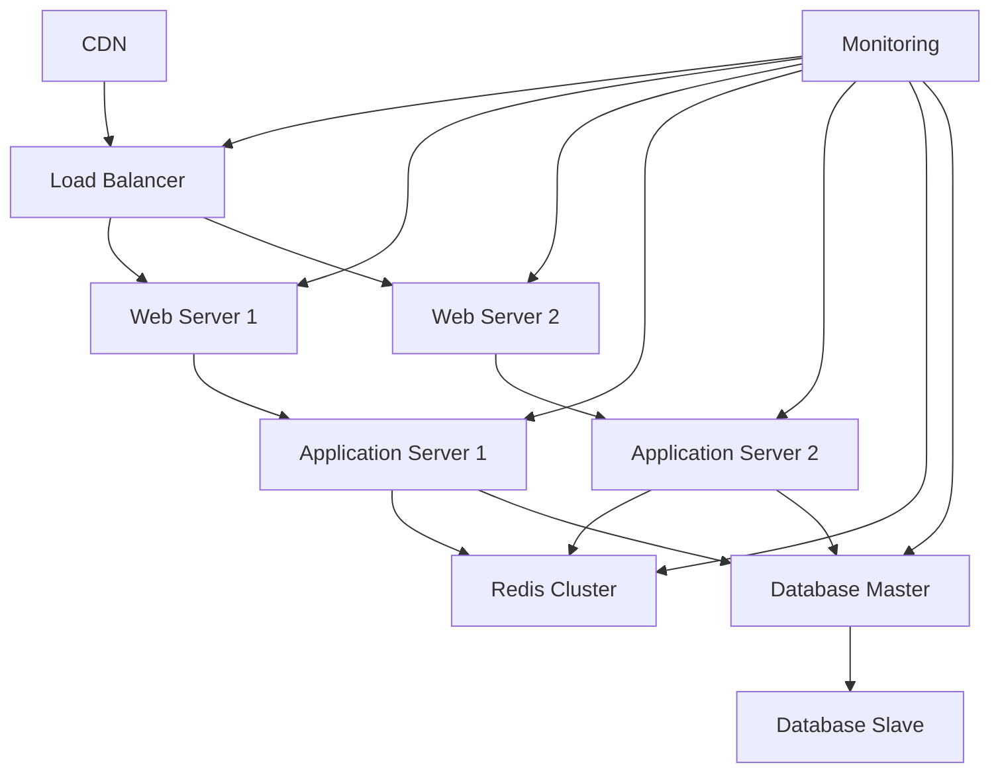

# Laporan Spesifikasi Lengkap - Ebara Inventory Management System

## 1. Informasi Umum

**Nama Aplikasi**: Ebara Inventory Management System  
**Versi**: 2.0  
**Deskripsi**: Sistem manajemen inventaris modern dengan fitur tracking QR Code, laporan multi-bahasa, dan dashboard eksekutif  
**Lisensi**: MIT  
**Tanggal Dokumentasi**: 17 Februari 2026  

## 2. Spesifikasi Bahasa Pemrograman & Framework

### Backend
- **Bahasa**: PHP 8.5.2 (CLI) - Zend Engine v4.5.2 dengan OPcache v8.5.2
- **Framework**: Laravel 12.46.0 (terinstall via Composer)
- **Arsitektur**: MVC (Model-View-Controller)
- **Pattern**: Repository Pattern, Service Layer
- **PHP Extensions yang Dibutuhkan**:
  - php-fpm
  - php-mysql
  - php-xml
  - php-mbstring
  - php-curl
  - php-zip
  - php-gd
  - php-bcmath
  - php-ctype
  - php-filter
  - php-hash
  - php-openssl
  - php-session
  - php-tokenizer

### Frontend
- **Template Engine**: Blade (.blade.php)
- **CSS Framework**: Tailwind CSS 3.1.0
- **JavaScript Framework**: Alpine.js 3.4.2
- **Build Tool**: Vite 7.0.7
- **Icon Library**: Phosphor Icons 2.1.2
- **Node.js Version**: v25.2.1
- **NPM Version**: 11.6.2

## 3. Spesifikasi Database

### Database yang Digunakan
- **Primary**: MariaDB 10.11.13 (Distrib 15.1)
- **Alternative**: SQLite (Development), PostgreSQL, SQL Server
- **Character Set**: utf8mb4
- **Collation**: utf8mb4_unicode_ci
- **Engine**: InnoDB
- **Migration System**: Laravel Migrations

### Konfigurasi Database
```env
DB_CONNECTION=mysql
DB_HOST=127.0.0.1
DB_PORT=3306
DB_DATABASE=inventory_management_system
DB_USERNAME=root
DB_PASSWORD=
```

### Struktur Database Utama
1. **users** - Manajemen pengguna dengan role-based access
2. **asset_materials** - Material inventaris dengan QR Code
3. **asset_tools** - Peralatan inventaris
4. **asset_models** - Model/mold inventaris
5. **gedungs** - Manajemen lokasi/gedung
6. **satuans** - Satuan unit (pcs, kg, liter, dll)
7. **mold_modifications** - Tracking modifikasi mold
8. **reports** - Sistem laporan dan issue tracking
9. **permission_tables** - Role-based permissions

## 4. Plugin & Packages Terinstall

### Composer Packages (PHP) - Versi Aktual

#### Core Laravel Packages
- `laravel/framework`: v12.46.0 - Core Laravel Framework
- `laravel/tinker`: v2.11.0 - CLI debugging tool
- `laravel/breeze`: v2.3.8 - Authentication scaffold
- `laravel/pint`: v1.27.0 - Code formatter
- `laravel/pail`: v1.2.4 - Log viewer
- `laravel/boost`: v1.8.9 - Laravel AI acceleration
- `laravel/mcp`: v0.5.2 - MCP server builder
- `laravel/sail`: v1.52.0 - Docker integration
- `laravel/prompts`: v0.3.8 - CLI prompts
- `laravel/roster`: v0.2.9 - Package detector

#### Feature Packages
- `barryvdh/laravel-dompdf`: v3.1.1 - PDF generation
- `maatwebsite/excel`: v3.1.67 - Excel export/import
- `simplesoftwareio/simple-qrcode`: v4.2.0 - QR Code generation
- `spatie/laravel-permission`: v6.24.0 - Role-based permissions

#### Supporting Libraries
- `nesbot/carbon`: v3.11.0 - Date/time manipulation
- `guzzlehttp/guzzle`: v7.10.0 - HTTP client
- `monolog/monolog`: v3.10.0 - Logging
- `fakerphp/faker`: v1.24.1 - Fake data generation
- `mockery/mockery`: v1.6.12 - Testing mock framework

### NPM Packages (Frontend) - Versi Aktual

#### Core Framework
- `vite`: v7.0.7 - Build tool
- `tailwindcss`: v3.1.0 - CSS framework
- `alpinejs`: v3.4.2 - Reactive UI components

#### UI Components & Libraries
- `apexcharts`: v5.3.6 - Chart library
- `datatables.net`: v1.13.6 - Data tables
- `html5-qrcode`: v2.3.8 - QR Code scanner
- `jquery`: v3.6.0 - DOM manipulation
- `sweetalert2`: v11.26.18 - Alert notifications
- `flatpickr`: v4.6.13 - Date picker
- `@phosphor-icons/web`: v2.1.2 - Icon library

#### Development Tools
- `axios`: v1.11.0 - HTTP client
- `autoprefixer`: v10.4.2 - CSS autoprefixer
- `postcss`: v8.4.31 - CSS processing
- `concurrently`: v9.0.1 - Concurrent script execution

## 5. Fitur-Fitur Utama Aplikasi

### Core Features
1. **Multi-Language Support**
   - Bahasa Indonesia & English
   - Dynamic language switching
   - Localized UI elements
   - Translation files di `lang/` directory

2. **Inventory Management**
   - Asset Materials tracking dengan QR Code
   - Asset Tools management
   - Asset Models/Mold tracking
   - Stock monitoring dengan alerts
   - Location-based management (Gedung)
   - Unit management (Satuan)

3. **User Management**
   - Role-based access control (RBAC)
   - User authentication dengan Laravel Breeze
   - Profile management
   - Permission management
   - Soft delete untuk data protection

4. **Reporting System**
   - Issue tracking dan reporting
   - PDF report generation dengan DomPDF
   - Excel export functionality dengan Maatwebsite Excel
   - Mold modification tracking
   - Admin notes pada reports

5. **Dashboard Eksekutif 2.0**
   - Real-time statistics
   - Interactive charts dengan ApexCharts
   - Omni-search functionality
   - Dynamic greetings
   - Responsive design
   - Glassmorphism effects

6. **QR Code System**
   - QR Code generation untuk assets
   - Mobile QR Code scanner dengan html5-qrcode
   - Universal QR scanner integration
   - QR Code path storage di database

7. **Security Features**
   - File upload security validation
   - Input sanitization middleware
   - CSRF protection
   - XSS prevention
   - SQL injection protection
   - OWASP Top 10 compliance

## 6. Spesifikasi Server Minimum yang Direkomendasikan

### Development Environment
**Berdasarkan Environment Saat Ini:**
- **OS**: Linux Debian/Ubuntu (saat ini Debian)
- **RAM**: 4GB minimum, 8GB recommended
- **Storage**: 20GB available space
- **PHP**: 8.5.2 (saat ini digunakan)
- **Node.js**: 25.2.1 (saat ini digunakan)
- **NPM**: 11.6.2 (saat ini digunakan)
- **Composer**: 2.0+
- **Database**: MariaDB 10.11.13 (saat ini digunakan)

### Production Environment

#### Small Scale (10-50 users)
- **CPU**: 2 cores
- **RAM**: 4GB
- **Storage**: 50GB SSD
- **Bandwidth**: 10 Mbps
- **Database**: MariaDB 10.11+ (dedicated instance)
- **Web Server**: Nginx 1.18+ atau Apache 2.4+
- **PHP-FPM**: 8.5+ dengan OPcache
- **Redis**: 6.0+ untuk caching dan sessions

#### Medium Scale (50-200 users)
- **CPU**: 4 cores
- **RAM**: 8GB
- **Storage**: 100GB SSD
- **Bandwidth**: 50 Mbps
- **Database**: MariaDB 10.11+ dengan optimization
- **Load Balancer**: Nginx atau HAProxy
- **CDN**: Untuk static assets
- **Redis Cluster**: Untuk high availability

#### Enterprise Scale (200+ users)
- **CPU**: 8+ cores
- **RAM**: 16GB+
- **Storage**: 200GB+ SSD dengan backup
- **Bandwidth**: 100+ Mbps
- **Database**: MariaDB Galera Cluster
- **Load Balancer**: HAProxy atau AWS ALB
- **CDN**: CloudFlare atau AWS CloudFront
- **Redis Cluster**: Multi-node setup
- **Monitoring**: Prometheus + Grafana
- **Logging**: ELK Stack atau Papertrail

### Server Configuration Requirements

#### Nginx Configuration
```nginx
# SSL/TLS Configuration
ssl_protocols TLSv1.2 TLSv1.3;
ssl_ciphers ECDHE-RSA-AES256-GCM-SHA512:DHE-RSA-AES256-GCM-SHA512;

# Security Headers
add_header X-Frame-Options "SAMEORIGIN" always;
add_header X-XSS-Protection "1; mode=block" always;
add_header X-Content-Type-Options "nosniff" always;

# File Upload Limits
client_max_body_size 50M;

# Gzip Compression
gzip on;
gzip_comp_level 6;
```

#### PHP Configuration
```ini
memory_limit = 256M
upload_max_filesize = 50M
post_max_size = 50M
max_execution_time = 300
max_input_vars = 3000
opcache.enable = 1
opcache.memory_consumption = 128
```

#### Database Optimization (MariaDB)
```sql
# MariaDB Configuration
innodb_buffer_pool_size = 2G (untuk 8GB RAM)
innodb_log_file_size = 256M
query_cache_size = 64M
max_connections = 200
```

### Environment Variables (Production)
```env
APP_ENV=production
APP_DEBUG=false
APP_KEY=<generate-unique-key>
APP_URL=https://your-domain.com

DB_CONNECTION=mysql
DB_HOST=127.0.0.1
DB_PORT=3306
DB_DATABASE=inventory_management_system
DB_USERNAME=inventory_user
DB_PASSWORD=<strong-password>

CACHE_DRIVER=redis
SESSION_DRIVER=redis
QUEUE_CONNECTION=redis

REDIS_HOST=127.0.0.1
REDIS_PASSWORD=<redis-password>
REDIS_PORT=6379

MAIL_MAILER=smtp
MAIL_HOST=your-smtp-server
MAIL_PORT=587
MAIL_USERNAME=your-email
MAIL_PASSWORD=<email-password>
```

## 7. Infrastructure Requirements

### Security Requirements
- **SSL Certificate**: Let's Encrypt atau commercial SSL
- **Firewall**: UFW atau cloud provider firewall
- **Backup**: Daily database backups dengan retention 30 days
- **Monitoring**: Server monitoring dengan alerts
- **Access Control**: SSH key-based authentication

### Backup Strategy
- **Database**: Daily automated backups
- **Files**: Weekly full backups
- **Code**: Version control dengan Git
- **Recovery Point Objective (RPO)**: 24 hours
- **Recovery Time Objective (RTO)**: 4 hours

### Performance Optimization
- **Caching**: Redis untuk sessions dan cache
- **CDN**: Untuk static assets
- **Database Indexing**: Proper indexing untuk queries
- **Image Optimization**: WebP format dengan fallback
- **Lazy Loading**: Untuk large datasets

## 8. Deployment Architecture



## 9. Compliance & Standards

### Security Compliance
- OWASP Top 10 vulnerability prevention
- GDPR compliance untuk data protection
- ISO 27001 security standards
- Regular security audits

### Code Quality Standards
- PSR-12 coding standards
- Laravel best practices
- Unit testing dengan Pest
- Code review process

## 10. Maintenance & Support

### Regular Maintenance Tasks
- **Weekly**: Security updates, log review
- **Monthly**: Dependency updates, performance tuning
- **Quarterly**: Security audits, backup testing
- **Annually**: Full system assessment, capacity planning

### Support Requirements
- **Technical Support**: 24/7 monitoring
- **User Support**: Business hours support
- **Emergency Response**: 2-hour response time
- **Documentation**: Complete technical documentation

## 11. Installation & Setup Commands

### Development Setup
```bash
# Clone repository
git clone <repository-url>
cd inventory-management-system

# Install PHP dependencies
composer install

# Install Node.js dependencies
npm install

# Environment setup
cp .env.example .env
php artisan key:generate

# Database setup
php artisan migrate

# Create storage link
php artisan storage:link

# Start development server
php artisan serve
npm run dev
```

### Production Deployment
```bash
# Install production dependencies
composer install --no-dev --optimize-autoloader
npm run build

# Optimize application
php artisan config:cache
php artisan route:cache
php artisan view:cache

# Run migrations
php artisan migrate --force

# Set permissions
chmod -R 755 storage
chmod -R 755 bootstrap/cache
```

## 12. Troubleshooting Common Issues

### Common PHP Issues
- **Memory Limit**: Increase `memory_limit` di php.ini
- **Execution Time**: Increase `max_execution_time` untuk large exports
- **File Upload**: Check `upload_max_filesize` dan `post_max_size`

### Database Issues
- **Connection Failed**: Verify database credentials dan connectivity
- **Migration Issues**: Check database permissions dan character set
- **Performance**: Add proper indexes dan optimize queries

### Frontend Issues
- **Build Failures**: Clear node_modules dan reinstall dependencies
- **Asset Loading**: Verify Vite configuration dan public path
- **CSS Issues**: Check Tailwind CSS compilation

---

**Dokumentasi ini dibuat berdasarkan analisis mendalam terhadap project Ebara Inventory Management System dengan versi aktual yang terinstall.**

**Last Updated**: 17 Februari 2026  
**Version**: 1.0.0  
**Author**: System Analysis Report