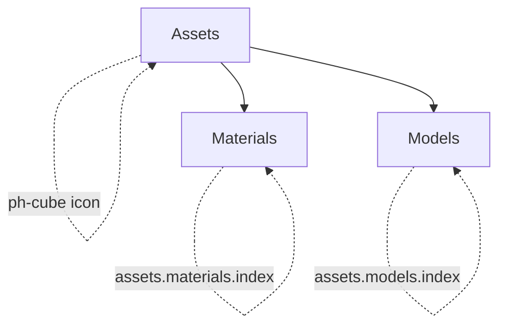
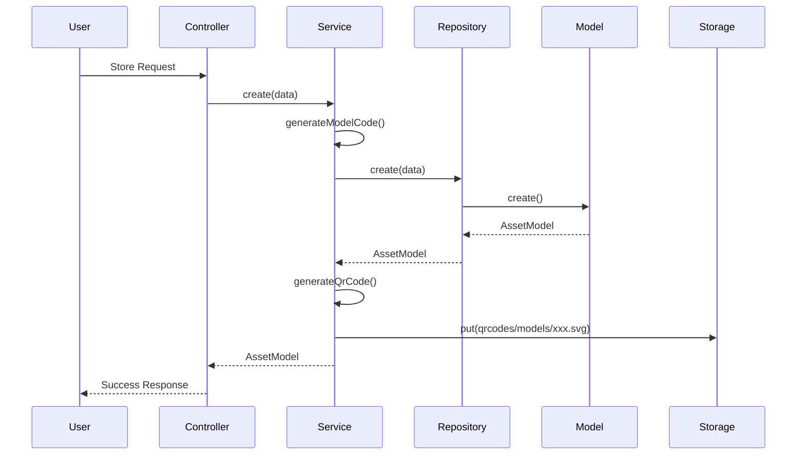
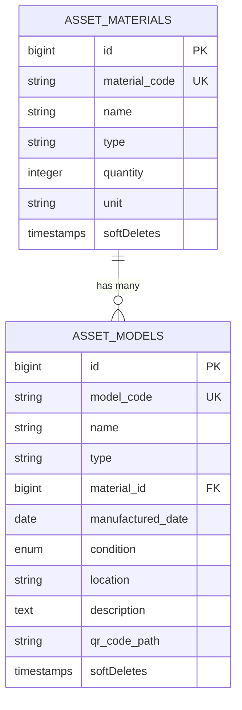

# Arsitektur Modul Assets - Blueprint

## Ringkasan

Dokumen ini merinci arsitektur untuk mengimplementasikan fitur "Models" dan merestrukturisasi navigasi Sidebar untuk mengelompokkan "Materials" dan "Models" di bawah modul "Assets".

---

## 1. Struktur Navigasi Sidebar

### Perubahan yang Diperlukan

Sidebar saat ini sudah memiliki dropdown "Asset Management". Berdasarkan persyaratan user, nama akan diubah menjadi "Assets" untuk konsistensi.

**Struktur Sidebar yang Diupdate:**

```php
// resources/views/components/layout/sidebar.blade.php

$menu = [
    // ... menu lainnya ...
    [
        'title' => 'Assets',           // Diubah dari 'Asset Management'
        'icon' => 'ph-cube',           // Icon Box/Cube
        'children' => [
            [
                'title' => 'Materials',
                'route' => 'assets.materials.index',
                'active' => request()->routeIs('assets.materials*'),
            ],
            [
                'title' => 'Models',
                'route' => 'assets.models.index',
                'active' => request()->routeIs('assets.models*'),
            ],
        ],
    ],
    // ... menu lainnya ...
];
```

**Komponen Sidebar Section (`sidebar-section.blade.php`):**

Komponen ini sudah menggunakan Alpine.js untuk mengelola state dropdown. Tidak ada perubahan yang diperlukan pada komponen ini.

```blade
<!-- State dropdown menggunakan Alpine.js -->
<div x-data="{ open: {{ request()->routeIs(collect($children)->pluck('active')->toArray()) ? 'true' : 'false' }} }">
    <!-- Header section clickable -->
    <button @click="open = !open">
        <!-- ... content ... -->
    </button>
    
    <!-- Children menu collapsible -->
    <div x-show="open" x-collapse>
        <!-- ... children ... -->
    </div>
</div>
```

---

## 2. Database Schema - Table `asset_models`

### Migration Baru

Migration yang ada (`2026_01_12_150002_create_asset_models_table.php`) perlu diupdate sepenuhnya.

**File:** `database/migrations/2026_01_12_150002_create_asset_models_table.php`

```php
<?php

use Illuminate\Database\Migrations\Migration;
use Illuminate\Database\Schema\Blueprint;
use Illuminate\Support\Facades\Schema;

return new class extends Migration
{
    /**
     * Run the migrations.
     */
    public function up(): void
    {
        Schema::create('asset_models', function (Blueprint $table) {
            $table->id();
            $table->string('model_code', 50)->unique()->comment('Kode unik model (M001, M002, dll)');
            $table->string('name')->comment('Nama model/cetakan');
            $table->string('type')->comment('Tipe (Injection, CNC, dll)');
            $table->foreignId('material_id')->nullable()->constrained('asset_materials')->nullOnDelete()->comment('Material terkait');
            $table->date('manufactured_date')->nullable()->comment('Tanggal pembuatan');
            $table->enum('condition', ['Good', 'Repair', 'Damaged'])->default('Good')->comment('Kondisi model');
            $table->string('location')->nullable()->comment('Lokasi penyimpanan (Gudang A, dll)');
            $table->text('description')->nullable()->comment('Deskripsi tambahan');
            $table->string('qr_code_path')->nullable()->comment('Path file QR Code');
            $table->timestamps();
            $table->softDeletes();
            
            // Indexes
            $table->index('model_code');
            $table->index('material_id');
            $table->index('condition');
        });
    }

    /**
     * Reverse the migrations.
     */
    public function down(): void
    {
        Schema::dropIfExists('asset_models');
    }
};
```

### Model Update

**File:** `app/Models/AssetModel.php`

```php
<?php

namespace App\Models;

use Illuminate\Database\Eloquent\Model;
use Illuminate\Database\Eloquent\Relations\BelongsTo;
use Illuminate\Database\Eloquent\SoftDeletes;

class AssetModel extends Model
{
    use SoftDeletes;

    /**
     * The attributes that are mass assignable.
     *
     * @var list<string>
     */
    protected $fillable = [
        'model_code',
        'name',
        'type',
        'material_id',
        'manufactured_date',
        'condition',
        'location',
        'description',
        'qr_code_path',
    ];

    /**
     * The attributes that should be cast.
     *
     * @return array<string, string>
     */
    protected function casts(): array
    {
        return [
            'manufactured_date' => 'date',
            'condition' => 'string',
        ];
    }

    /**
     * Get the asset material that this model belongs to.
     */
    public function material(): BelongsTo
    {
        return $this->belongsTo(AssetMaterial::class, 'material_id');
    }

    /**
     * Get condition label (Indonesian).
     */
    public function getConditionLabelAttribute(): string
    {
        return match($this->condition) {
            'Good' => 'Baik',
            'Repair' => 'Perbaikan',
            'Damaged' => 'Rusak',
            default => 'Tidak Diketahui',
        };
    }

    /**
     * Get condition badge color.
     */
    public function getConditionColorAttribute(): string
    {
        return match($this->condition) {
            'Good' => 'success',
            'Repair' => 'warning',
            'Damaged' => 'danger',
            default => 'secondary',
        };
    }
}
```

---

## 3. Routes Architecture

**File:** `routes/web.php`

Routes sudah terorganisir dengan baik di bawah prefix `assets`. Perlu ditambahkan routes lengkap untuk Models.

```php
Route::middleware('auth')->group(function () {
    // ... route lainnya ...
    
    // Asset Management Routes
    Route::prefix('assets')->name('assets.')->group(function () {
        // Materials (Existing - No Changes Needed)
        Route::get('materials', [AssetManagementController::class, 'index'])->name('materials.index');
        Route::get('materials/data', [AssetManagementController::class, 'getData'])->name('materials.data');
        Route::get('materials/{id}', [AssetManagementController::class, 'show'])->name('materials.show');
        Route::post('materials', [AssetManagementController::class, 'store'])->name('materials.store');
        Route::put('materials/{id}', [AssetManagementController::class, 'update'])->name('materials.update');
        Route::delete('materials/{id}', [AssetManagementController::class, 'destroy'])->name('materials.destroy');
        Route::get('materials/{id}/qr-code', [AssetManagementController::class, 'qrCode'])->name('materials.qr-code');
        Route::get('materials/export', [AssetManagementController::class, 'export'])->name('materials.export');
        
        // Tools (Existing - No Changes Needed)
        Route::get('tools', [AssetManagementController::class, 'tools'])->name('tools.index');
        
        // Models (NEW - Full CRUD + Features)
        Route::get('models', [AssetModelController::class, 'index'])->name('models.index');
        Route::get('models/data', [AssetModelController::class, 'getData'])->name('models.data');
        Route::get('models/{id}', [AssetModelController::class, 'show'])->name('models.show');
        Route::post('models', [AssetModelController::class, 'store'])->name('models.store');
        Route::put('models/{id}', [AssetModelController::class, 'update'])->name('models.update');
        Route::delete('models/{id}', [AssetModelController::class, 'destroy'])->name('models.destroy');
        Route::get('models/{id}/qr-code', [AssetModelController::class, 'qrCode'])->name('models.qr-code');
        Route::get('models/export', [AssetModelController::class, 'export'])->name('models.export');
    });
});
```

---

## 4. File Structure untuk Modul Models

```
app/
├── Http/
│   ├── Controllers/
│   │   └── AssetModelController.php           # NEW - Controller untuk Models
│   └── Requests/
│       ├── StoreAssetModelRequest.php         # NEW - Validasi create
│       └── UpdateAssetModelRequest.php        # UPDATE - Validasi update (ganti rules)
├── Models/
│   └── AssetModel.php                          # UPDATE - Update model sesuai schema baru
├── Repositories/
│   ├── Contracts/
│   │   └── AssetModelRepositoryInterface.php  # UPDATE - Interface
│   └── AssetModelRepository.php                # UPDATE - Repository implementation
├── Services/
│   └── AssetModelService.php                   # NEW - Service layer untuk Models
└── Exports/
    └── AssetModelsExport.php                   # NEW - Excel export class

resources/views/
└── asset_models/
    └── index.blade.php                        # UPDATE - View lengkap dengan DataTables
```

---

## 5. Komponen yang Dibuat/Update

### 5.1 AssetModelController (NEW)

**File:** `app/Http/Controllers/AssetModelController.php`

```php
<?php

namespace App\Http\Controllers;

use App\Http\Controllers\Controller;
use App\Http\Requests\StoreAssetModelRequest;
use App\Http\Requests\UpdateAssetModelRequest;
use App\Models\AssetModel;
use App\Services\AssetModelService;
use Illuminate\Http\Request;
use Illuminate\View\View;
use Maatwebsite\Excel\Facades\Excel;
use App\Exports\AssetModelsExport;

class AssetModelController extends Controller
{
    public function __construct(
        protected AssetModelService $assetModelService
    ) {}

    public function index(): View
    {
        return view('asset_models.index');
    }

    public function store(StoreAssetModelRequest $request)
    {
        try {
            $this->assetModelService->create($request->validated());
            return response()->json([
                'success' => true,
                'message' => 'Model berhasil ditambahkan'
            ]);
        } catch (\Exception $e) {
            return response()->json([
                'success' => false,
                'message' => 'Gagal menambahkan model: ' . $e->getMessage()
            ], 500);
        }
    }

    public function show(int $id)
    {
        try {
            $model = $this->assetModelService->find($id);
            if (!$model) {
                return response()->json(['success' => false, 'message' => 'Model tidak ditemukan'], 404);
            }
            return response()->json(['success' => true, 'data' => [
                'id' => $model->id,
                'model_code' => $model->model_code,
                'name' => $model->name,
                'type' => $model->type,
                'material_id' => $model->material_id,
                'manufactured_date' => $model->manufactured_date?->format('Y-m-d'),
                'condition' => $model->condition,
                'location' => $model->location,
                'description' => $model->description,
            ]]);
        } catch (\Exception $e) {
            return response()->json(['success' => false, 'message' => 'Gagal mengambil data model'], 500);
        }
    }

    public function update(UpdateAssetModelRequest $request, int $id)
    {
        try {
            $updated = $this->assetModelService->update($id, $request->validated());
            if (!$updated) {
                return response()->json(['success' => false, 'message' => 'Model tidak ditemukan'], 404);
            }
            return response()->json(['success' => true, 'message' => 'Model berhasil diperbarui']);
        } catch (\Exception $e) {
            return response()->json(['success' => false, 'message' => 'Gagal memperbarui model'], 500);
        }
    }

    public function destroy(int $id)
    {
        try {
            $deleted = $this->assetModelService->delete($id);
            if (!$deleted) {
                return response()->json(['success' => false, 'message' => 'Model tidak ditemukan'], 404);
            }
            return response()->json(['success' => true, 'message' => 'Model berhasil dihapus']);
        } catch (\Exception $e) {
            return response()->json(['success' => false, 'message' => 'Gagal menghapus model'], 500);
        }
    }

    public function qrCode(int $id)
    {
        $model = $this->assetModelService->find($id);
        if (!$model) {
            return response()->json(['success' => false, 'message' => 'Model tidak ditemukan'], 404);
        }
        return response()->json([
            'success' => true,
            'qr_code_url' => $this->assetModelService->getQrCodeUrl($model),
            'qrCode' => $this->assetModelService->getQrCodeHtml($model),
            'modelCode' => $model->model_code
        ]);
    }

    public function export()
    {
        return Excel::download(new AssetModelsExport(), 'models-' . date('Y-m-d') . '.xlsx');
    }

    public function getData(Request $request)
    {
        $draw = $request->get('draw');
        $start = $request->get('start');
        $length = $request->get('length');
        $search = $request->get('search')['value'] ?? '';

        $query = AssetModel::with('material:id,name');

        if ($search) {
            $query->where('name', 'like', "%{$search}%")
                ->orWhere('model_code', 'like', "%{$search}%")
                ->orWhere('type', 'like', "%{$search}%");
        }

        $totalRecords = $query->count();

        $models = $query->offset($start)
            ->limit($length)
            ->orderBy('created_at', 'desc')
            ->get();

        $data = $models->map(function ($model) {
            return [
                'id' => $model->id,
                'model_code' => $model->model_code,
                'name' => $model->name,
                'type' => $model->type,
                'material_name' => $model->material?->name ?? '-',
                'manufactured_date' => $model->manufactured_date?->format('d/m/Y') ?? '-',
                'condition' => $model->condition,
                'condition_label' => $model->condition_label,
                'condition_color' => $model->condition_color,
                'location' => $model->location ?? '-',
                'qr_code_url' => $this->assetModelService->getQrCodeUrl($model),
                'created_at' => $model->created_at->format('d/m/Y H:i'),
            ];
        });

        $stats = [
            'total' => AssetModel::count(),
            'good' => AssetModel::where('condition', 'Good')->count(),
            'repair' => AssetModel::where('condition', 'Repair')->count(),
            'damaged' => AssetModel::where('condition', 'Damaged')->count(),
        ];

        return response()->json([
            'draw' => $draw,
            'recordsTotal' => $totalRecords,
            'recordsFiltered' => $totalRecords,
            'data' => $data,
            'stats' => $stats,
        ]);
    }
}
```

### 5.2 StoreAssetModelRequest (NEW)

**File:** `app/Http/Requests/StoreAssetModelRequest.php`

```php
<?php

namespace App\Http\Requests;

use Illuminate\Foundation\Http\FormRequest;
use Illuminate\Contracts\Validation\Validator;
use Illuminate\Http\Exceptions\HttpResponseException;

class StoreAssetModelRequest extends FormRequest
{
    public function authorize(): bool
    {
        return true;
    }

    public function rules(): array
    {
        return [
            'model_code' => 'nullable|string|max:50|unique:asset_models,model_code',
            'name' => 'required|string|max:255',
            'type' => 'required|string|max:100',
            'material_id' => 'nullable|exists:asset_materials,id',
            'manufactured_date' => 'nullable|date',
            'condition' => 'required|in:Good,Repair,Damaged',
            'location' => 'nullable|string|max:255',
            'description' => 'nullable|string',
        ];
    }

    public function messages(): array
    {
        return [
            'model_code.unique' => 'Kode model sudah digunakan',
            'name.required' => 'Nama model wajib diisi',
            'type.required' => 'Tipe model wajib diisi',
            'material_id.exists' => 'Material tidak ditemukan',
            'condition.required' => 'Kondisi wajib dipilih',
            'condition.in' => 'Kondisi tidak valid',
        ];
    }

    protected function failedValidation(Validator $validator): void
    {
        throw new HttpResponseException(
            response()->json([
                'success' => false,
                'message' => 'Validasi gagal',
                'errors' => $validator->errors(),
            ], 422)
        );
    }
}
```

### 5.3 UpdateAssetModelRequest (UPDATE)

**File:** `app/Http/Requests/UpdateAssetModelRequest.php`

```php
<?php

namespace App\Http\Requests;

use Illuminate\Foundation\Http\FormRequest;
use Illuminate\Contracts\Validation\Validator;
use Illuminate\Http\Exceptions\HttpResponseException;

class UpdateAssetModelRequest extends FormRequest
{
    public function authorize(): bool
    {
        return true;
    }

    public function rules(): array
    {
        $modelId = $this->route('id');
        return [
            'model_code' => 'nullable|string|max:50|unique:asset_models,model_code,' . $modelId,
            'name' => 'required|string|max:255',
            'type' => 'required|string|max:100',
            'material_id' => 'nullable|exists:asset_materials,id',
            'manufactured_date' => 'nullable|date',
            'condition' => 'required|in:Good,Repair,Damaged',
            'location' => 'nullable|string|max:255',
            'description' => 'nullable|string',
        ];
    }

    public function messages(): array
    {
        return [
            'model_code.unique' => 'Kode model sudah digunakan',
            'name.required' => 'Nama model wajib diisi',
            'type.required' => 'Tipe model wajib diisi',
            'material_id.exists' => 'Material tidak ditemukan',
            'condition.required' => 'Kondisi wajib dipilih',
            'condition.in' => 'Kondisi tidak valid',
        ];
    }

    protected function failedValidation(Validator $validator): void
    {
        throw new HttpResponseException(
            response()->json([
                'success' => false,
                'message' => 'Validasi gagal',
                'errors' => $validator->errors(),
            ], 422)
        );
    }
}
```

### 5.4 AssetModelService (NEW)

**File:** `app/Services/AssetModelService.php`

```php
<?php

namespace App\Services;

use App\Models\AssetModel;
use App\Repositories\Contracts\AssetModelRepositoryInterface;
use Illuminate\Support\Facades\Storage;
use Illuminate\Support\Facades\Log;
use SimpleSoftwareIO\QrCode\Facades\QrCode;
use Illuminate\Support\Str;

class AssetModelService
{
    public function __construct(
        protected AssetModelRepositoryInterface $assetModelRepository
    ) {}

    public function getAll(): \Illuminate\Database\Eloquent\Collection
    {
        return $this->assetModelRepository->all();
    }

    public function find(int $id): ?AssetModel
    {
        return $this->assetModelRepository->find($id);
    }

    public function create(array $data): AssetModel
    {
        if (!isset($data['model_code']) || empty($data['model_code'])) {
            $data['model_code'] = $this->generateModelCode();
        }

        $model = $this->assetModelRepository->create($data);
        $this->generateQrCode($model);

        return $model->fresh();
    }

    public function update(int $id, array $data): bool
    {
        $model = $this->find($id);
        if (!$model) {
            return false;
        }

        $model->update($data);

        if (isset($data['model_code']) && $data['model_code'] !== $model->getOriginal('model_code')) {
            $this->generateQrCode($model);
        }

        return true;
    }

    public function delete(int $id): bool
    {
        $model = $this->find($id);
        if (!$model) {
            return false;
        }

        $this->deleteQrCode($model);
        $model->delete();

        return true;
    }

    protected function generateModelCode(): string
    {
        $datePrefix = now()->format('Ymd');
        $randomSuffix = strtoupper(Str::random(3));
        $code = "MOD-{$datePrefix}-{$randomSuffix}";

        while ($this->assetModelRepository->findByCode($code)) {
            $randomSuffix = strtoupper(Str::random(3));
            $code = "MOD-{$datePrefix}-{$randomSuffix}";
        }

        return $code;
    }

    protected function generateQrCode(AssetModel $model): void
    {
        try {
            $qrCode = QrCode::format('svg')
                ->size(150)
                ->margin(1)
                ->errorCorrection('H')
                ->generate($model->model_code);

            $path = "qrcodes/models/{$model->model_code}.svg";
            Storage::disk('public')->put($path, $qrCode);
        } catch (\Exception $e) {
            Log::error('Gagal generate QR Code untuk model: ' . $model->model_code, [
                'error' => $e->getMessage()
            ]);
        }
    }

    protected function deleteQrCode(AssetModel $model): void
    {
        try {
            $path = "qrcodes/models/{$model->model_code}.svg";
            if (Storage::disk('public')->exists($path)) {
                Storage::disk('public')->delete($path);
            }
        } catch (\Exception $e) {
            Log::error('Gagal menghapus QR Code untuk model: ' . $model->model_code, [
                'error' => $e->getMessage()
            ]);
        }
    }

    public function getQrCodeUrl(AssetModel $model): string
    {
        $path = "qrcodes/models/{$model->model_code}.svg";
        
        if (Storage::disk('public')->exists($path)) {
            return Storage::url($path);
        }

        $this->generateQrCode($model);
        return Storage::url($path);
    }

    public function getQrCodeHtml(AssetModel $model): string
    {
        try {
            $path = "qrcodes/models/{$model->model_code}.svg";
            
            if (!Storage::disk('public')->exists($path)) {
                $this->generateQrCode($model);
            }
            
            $qrCodeContent = Storage::disk('public')->get($path);
            return '';
        } catch (\Exception $e) {
            Log::error('Gagal menampilkan QR Code untuk model: ' . $model->model_code, [
                'error' => $e->getMessage()
            ]);
            return '<p class="text-red-500">QR Code tidak tersedia</p>';
        }
    }
}
```

### 5.5 AssetModelRepository (UPDATE)

**File:** `app/Repositories/AssetModelRepository.php`

```php
<?php

namespace App\Repositories;

use App\Models\AssetModel;
use App\Repositories\Contracts\AssetModelRepositoryInterface;
use Illuminate\Support\Collection;

class AssetModelRepository implements AssetModelRepositoryInterface
{
    public function all(): Collection
    {
        return AssetModel::with('material')->get();
    }

    public function find(int $id): ?AssetModel
    {
        return AssetModel::with('material')->find($id);
    }

    public function create(array $data): AssetModel
    {
        return AssetModel::create($data);
    }

    public function update(int $id, array $data): bool
    {
        $model = $this->find($id);
        if (!$model) {
            return false;
        }
        $model->update($data);
        return true;
    }

    public function delete(int $id): bool
    {
        $model = $this->find($id);
        if (!$model) {
            return false;
        }
        $model->delete();
        return true;
    }

    public function search(string $query): Collection
    {
        return AssetModel::where('name', 'like', "%{$query}%")
            ->orWhere('model_code', 'like', "%{$query}%")
            ->orderBy('name', 'asc')
            ->get();
    }

    public function findByCode(string $code): ?AssetModel
    {
        return AssetModel::where('model_code', $code)->first();
    }
}
```

### 5.6 AssetModelRepositoryInterface (UPDATE)

**File:** `app/Repositories/Contracts/AssetModelRepositoryInterface.php`

```php
<?php

namespace App\Repositories\Contracts;

use App\Models\AssetModel;
use Illuminate\Support\Collection;

interface AssetModelRepositoryInterface
{
    public function all(): Collection;
    public function find(int $id): ?AssetModel;
    public function create(array $data): AssetModel;
    public function update(int $id, array $data): bool;
    public function delete(int $id): bool;
    public function search(string $query): Collection;
    public function findByCode(string $code): ?AssetModel;
}
```

### 5.7 AssetModelsExport (NEW)

**File:** `app/Exports/AssetModelsExport.php`

```php
<?php

namespace App\Exports;

use App\Models\AssetModel;
use Maatwebsite\Excel\Concerns\FromCollection;
use Maatwebsite\Excel\Concerns\WithHeadings;
use Maatwebsite\Excel\Concerns\WithMapping;

class AssetModelsExport implements FromCollection, WithHeadings, WithMapping
{
    public function collection()
    {
        return AssetModel::with('material')->orderBy('created_at', 'desc')->get();
    }

    public function headings(): array
    {
        return [
            'Kode Model',
            'Nama Model',
            'Tipe',
            'Material',
            'Tanggal Pembuatan',
            'Kondisi',
            'Lokasi',
            'Deskripsi',
            'Tanggal Dibuat',
        ];
    }

    public function map($model): array
    {
        return [
            $model->model_code,
            $model->name,
            $model->type,
            $model->material?->name ?? '-',
            $model->manufactured_date ? $model->manufactured_date->format('d/m/Y') : '-',
            $model->condition_label,
            $model->location ?? '-',
            $model->description ?? '-',
            $model->created_at->format('d/m/Y H:i'),
        ];
    }
}
```

### 5.8 View Models Index (UPDATE)

**File:** `resources/views/asset_models/index.blade.php`

View ini akan mengikuti struktur yang sama dengan `asset_materials/index.blade.php` dengan penyesuaian:
- Header: "Model Aset" / "Kelola inventaris model dan cetakan"
- Stats Cards: Total Model, Kondisi Baik, Perbaikan, Rusak
- Table Columns: Kode, Nama, Tipe, Material, Tgl Pembuatan, Kondisi, Lokasi, Aksi
- Form Fields: model_code (auto), name, type, material_id (dropdown), manufactured_date, condition (select), location, description

---

## 6. Diagram Arsitektur

### 6.1 Struktur Navigasi



### 6.2 Alur Data Models



### 6.3 Relationship Database



---

## 7. Checklist Implementasi

### Database
- [ ] Update migration `2026_01_12_150002_create_asset_models_table.php`
- [ ] Run migration: `php artisan migrate:fresh` atau rollback & migrate

### Backend
- [ ] Update `app/Models/AssetModel.php`
- [ ] Create `app/Http/Controllers/AssetModelController.php`
- [ ] Create `app/Http/Requests/StoreAssetModelRequest.php`
- [ ] Update `app/Http/Requests/UpdateAssetModelRequest.php`
- [ ] Create `app/Services/AssetModelService.php`
- [ ] Update `app/Repositories/AssetModelRepository.php`
- [ ] Update `app/Repositories/Contracts/AssetModelRepositoryInterface.php`
- [ ] Create `app/Exports/AssetModelsExport.php`
- [ ] Update `routes/web.php` - tambah routes lengkap Models

### Frontend
- [ ] Update `resources/views/components/layout/sidebar.blade.php` - ganti "Asset Management" ke "Assets"
- [ ] Create/Update `resources/views/asset_models/index.blade.php`

### Testing
- [ ] Test CRUD operations
- [ ] Test QR Code generation
- [ ] Test Excel export
- [ ] Test DataTables server-side rendering
- [ ] Test Material relationship

---

## 8. Catatan Penting

1. **Soft Deletes**: Model menggunakan soft deletes untuk keamanan data
2. **QR Code Storage**: Disimpan di `storage/app/public/qrcodes/models/`
3. **Model Code Format**: `MOD-YYYYMMDD-XXX` (auto-generated jika tidak diisi)
4. **Material Relationship**: Opsional (nullable), model bisa berdiri sendiri tanpa material
5. **UI Consistency**: Gunakan komponen yang sama dengan Materials (`x-ui.card`, `x-ui.badge`, dll)
6. **Alpine.js**: Sidebar dropdown sudah menggunakan Alpine.js, tidak perlu perubahan pada komponen

---

## 9. Dependencies yang Dibutuhkan

Pastikan package berikut sudah terinstall:
- `maatwebsite/excel` - Untuk export Excel
- `simplesoftwareio/simple-qrcode` - Untuk generate QR Code

Cek di `composer.json`:
```json
"require": {
    "maatwebsite/excel": "^3.1",
    "simplesoftwareio/simple-qrcode": "^4.2"
}
```

---

*Blueprint ini siap untuk implementasi. Setiap komponen dapat dibuat/update secara independen.*
