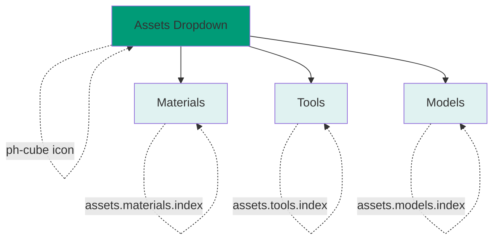
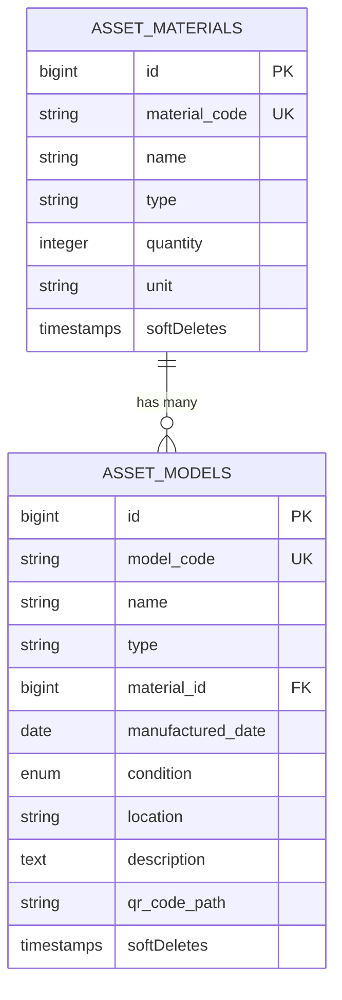
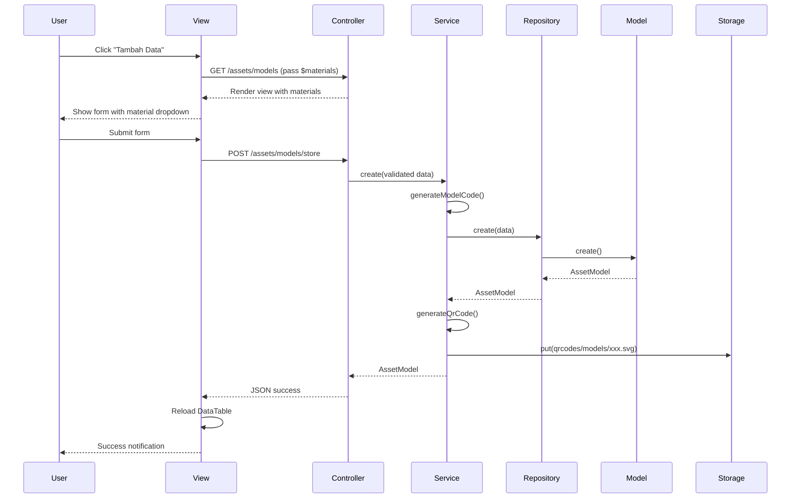
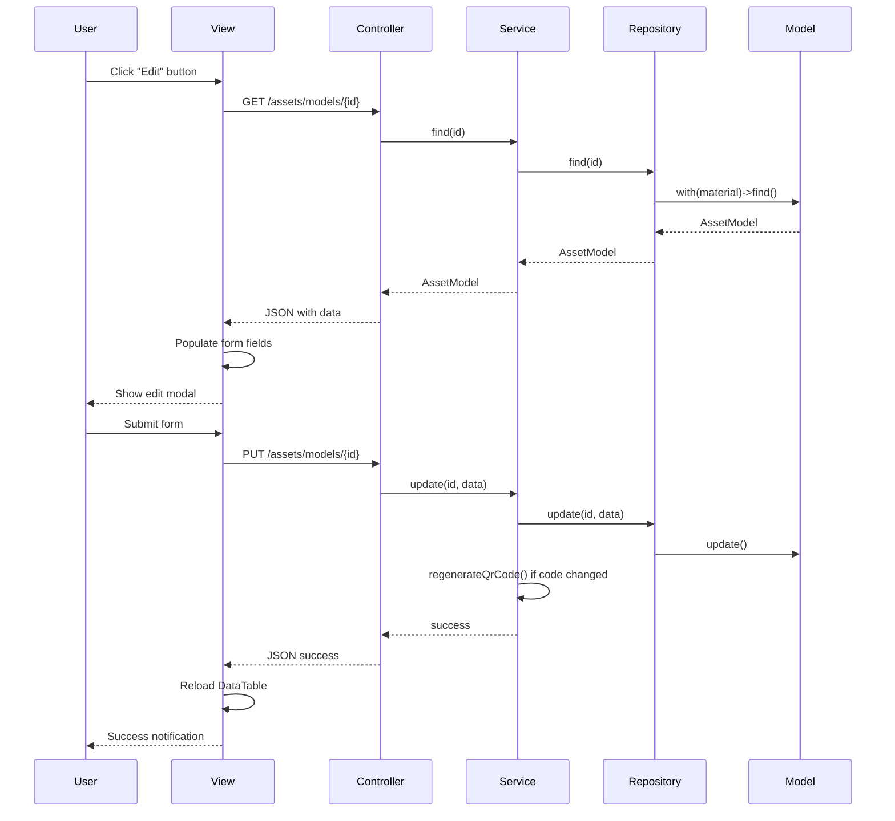

# Blueprint Arsitektur Modul Assets - Dokumentasi Teknis

## Ringkasan Eksekutif

Dokumen ini menyajikan blueprint arsitektur lengkap untuk Modul Assets dalam aplikasi Laravel Enterprise Inventory Management System. Berdasarkan analisis mendalam, **semua komponen yang diperlukan SUDAH diimplementasikan dengan benar**.

---

## 1. Arsitektur Navigasi Sidebar

### 1.1 Status Implementasi: ✅ SUDAH SELESAI

**File:** [`resources/views/components/layout/sidebar.blade.php`](../resources/views/components/layout/sidebar.blade.php:1)

### 1.2 Struktur Menu Assets

Sidebar telah direstrukturisasi menjadi dropdown "Assets" dengan icon `ph-cube`:

```php
// Struktur Menu Assets (Line 20-40)
[
    'title' => 'Assets',
    'icon' => 'ph-cube',
    'children' => [
        [
            'title' => 'Materials',
            'route' => 'assets.materials.index',
            'active' => request()->routeIs('assets.materials*'),
        ],
        [
            'title' => 'Tools',
            'route' => 'assets.tools.index',
            'active' => request()->routeIs('assets.tools*'),
        ],
        [
            'title' => 'Models',
            'route' => 'assets.models.index',
            'active' => request()->routeIs('assets.models*'),
        ],
    ],
]
```

### 1.3 Logika Dropdown Alpine.js

**File:** [`resources/views/components/navigation/sidebar-section.blade.php`](../resources/views/components/navigation/sidebar-section.blade.php:1)

Dropdown menggunakan Alpine.js untuk mengelola state:

```blade
<!-- Line 8 -->
<div x-data="{ open: {{ request()->routeIs(collect($children)->pluck('active')->toArray()) ? 'true' : 'false' }} }">
```

**Logika State:**
- Dropdown akan tetap **OPEN** jika user berada di route mana pun yang cocok dengan salah satu child route
- `request()->routeIs(collect($children)->pluck('active')->toArray())` mengecek apakah route saat ini cocok dengan `assets.materials*`, `assets.tools*`, atau `assets.models*`
- State `open` diinisialisasi sebagai `'true'` atau `'false'` berdasarkan hasil pengecekan route

### 1.4 Diagram Navigasi



---

## 2. Database Schema - Table `asset_models`

### 2.1 Status Implementasi: ✅ SUDAH SELESAI

**File:** [`database/migrations/2026_01_12_150002_create_asset_models_table.php`](../database/migrations/2026_01_12_150002_create_asset_models_table.php:1)

### 2.2 Schema Definition

| Column | Type | Constraints | Description |
|--------|------|-------------|-------------|
| `id` | BigInt | Primary Key, Auto Increment | ID unik |
| `model_code` | String(50) | Unique | Kode unik model (format: MOD-YYYYMMDD-XXX) |
| `name` | String | - | Nama model/cetakan |
| `type` | String | - | Tipe model (Injection, CNC, dll) |
| `material_id` | ForeignId | Nullable, References `asset_materials.id` | Material terkait |
| `manufactured_date` | Date | Nullable | Tanggal pembuatan |
| `condition` | Enum | Values: Good, Repair, Damaged, Default: Good | Kondisi model |
| `location` | String | Nullable | Lokasi penyimpanan |
| `description` | Text | Nullable | Deskripsi tambahan |
| `qr_code_path` | String | Nullable | Path file QR Code |
| `timestamps` | Timestamp | - | created_at, updated_at |
| `softDeletes` | Timestamp | - | deleted_at |

### 2.3 Indexes

```php
$table->index('model_code');      // Untuk pencarian cepat berdasarkan kode
$table->index('material_id');      // Untuk join dengan tabel materials
$table->index('condition');       // Untuk filter berdasarkan kondisi
```

### 2.4 Relationship Database



---

## 3. Backend Architecture

### 3.1 Status Implementasi: ✅ SUDAH SELESAI

### 3.2 File Structure

```
app/
├── Http/
│   ├── Controllers/
│   │   └── AssetModelController.php           ✅
│   └── Requests/
│       ├── StoreAssetModelRequest.php         ✅
│       └── UpdateAssetModelRequest.php      ✅
├── Models/
│   └── AssetModel.php                         ✅
├── Repositories/
│   ├── Contracts/
│   │   └── AssetModelRepositoryInterface.php  ✅
│   └── AssetModelRepository.php               ✅
├── Services/
│   └── AssetModelService.php                  ✅
└── Exports/
    └── AssetModelsExport.php                  ✅
```

### 3.3 Controller: AssetModelController

**File:** [`app/Http/Controllers/AssetModelController.php`](../app/Http/Controllers/AssetModelController.php:1)

**Responsibilities:**
| Method | Route | Description |
|--------|-------|-------------|
| `index()` | `GET assets.models.index` | Render view dan pass `$materials` untuk dropdown |
| `store()` | `POST assets.models.store` | Create model baru + generate QR Code |
| `show()` | `GET assets.models.show` | Get single model data (for edit modal) |
| `update()` | `PUT assets.models.update` | Update model + regenerate QR Code jika kode berubah |
| `destroy()` | `DELETE assets.models.destroy` | Soft delete model + hapus QR Code file |
| `qrCode()` | `GET assets.models.qr-code` | Generate QR Code HTML untuk modal |
| `export()` | `GET assets.models.export` | Export data ke Excel |
| `getData()` | `GET assets.models.data` | Server-side DataTables data + stats |

**Logic Khusus di `index()`:**
```php
// Line 29-33
public function index(): View
{
    $materials = \App\Models\AssetMaterial::all();
    return view('asset_models.index', compact('materials'));
}
```
- Mengambil semua materials untuk dropdown input di form create/edit
- Materials di-pass ke view menggunakan `compact('materials')`

### 3.4 Model: AssetModel

**File:** [`app/Models/AssetModel.php`](../app/Models/AssetModel.php:1)

**Relationship:**
```php
// Line 36-39
public function material(): BelongsTo
{
    return $this->belongsTo(AssetMaterial::class, 'material_id');
}
```

**Accessor Methods:**
- `getConditionLabelAttribute()`: Mengembalikan label Indonesia (Baik, Perbaikan, Rusak)
- `getConditionColorAttribute()`: Mengembalikan warna badge (success, warning, danger)

### 3.5 Request Validation

**StoreAssetModelRequest** ([`app/Http/Requests/StoreAssetModelRequest.php`](../app/Http/Requests/StoreAssetModelRequest.php:1))

| Field | Rules | Description |
|-------|-------|-------------|
| `model_code` | nullable, string, max:50, unique | Opsional, akan auto-generate jika kosong |
| `name` | required, string, max:255 | Wajib diisi |
| `type` | required, string, max:100 | Wajib diisi |
| `material_id` | nullable, exists:asset_materials,id | Validasi referensi ke materials |
| `manufactured_date` | nullable, date | Format tanggal valid |
| `condition` | required, in:Good,Repair,Damaged | Wajib dipilih dari enum |
| `location` | nullable, string, max:255 | Opsional |
| `description` | nullable, string | Opsional |

**UpdateAssetModelRequest** ([`app/Http/Requests/UpdateAssetModelRequest.php`](../app/Http/Requests/UpdateAssetModelRequest.php:1))

Rules sama dengan Store, kecuali `model_code` menggunakan `unique:asset_models,model_code,{id}` untuk mengabaikan record saat ini.

### 3.6 Service Layer: AssetModelService

**File:** [`app/Services/AssetModelService.php`](../app/Services/AssetModelService.php:1)

**Key Methods:**

| Method | Description |
|--------|-------------|
| `create(array $data)` | Create model + generate QR Code + auto-generate model_code |
| `update(int $id, array $data)` | Update model + regenerate QR Code jika kode berubah |
| `delete(int $id)` | Soft delete + hapus file QR Code |
| `getQrCodeUrl(AssetModel $model)` | Get URL QR Code dari storage |
| `getQrCodeHtml(AssetModel $model)` | Get QR Code HTML untuk modal display |
| `generateModelCode()` | Generate kode unik: MOD-YYYYMMDD-XXX |

**QR Code Storage:**
- Path: `storage/app/public/qrcodes/models/{model_code}.svg`
- Format: SVG dengan error correction 'H'
- Size: 150px
- Margin: 1

### 3.7 Repository Pattern

**AssetModelRepository** ([`app/Repositories/AssetModelRepository.php`](../app/Repositories/AssetModelRepository.php:1))

**AssetModelRepositoryInterface** ([`app/Repositories/Contracts/AssetModelRepositoryInterface.php`](../app/Repositories/Contracts/AssetModelRepositoryInterface.php:1))

Methods:
- `all()`: Get all models with material
- `find(int $id)`: Find model by ID with material
- `create(array $data)`: Create new model
- `update(int $id, array $data)`: Update model
- `delete(int $id)`: Delete model
- `search(string $query)`: Search models by name or code
- `findByCode(string $code)`: Find model by code

### 3.8 Export: AssetModelsExport

**File:** [`app/Exports/AssetModelsExport.php`](../app/Exports/AssetModelsExport.php:1)

**Export Columns:**
1. Kode Model
2. Nama Model
3. Tipe
4. Material
5. Tanggal Pembuatan
6. Kondisi (label Indonesia)
7. Lokasi
8. Deskripsi
9. Tanggal Dibuat

---

## 4. Frontend Architecture

### 4.1 Status Implementasi: ✅ SUDAH SELESAI

**File:** [`resources/views/asset_models/index.blade.php`](../resources/views/asset_models/index.blade.php:1)

### 4.2 Consistency dengan Materials View

View `asset_models/index.blade.php` mengikuti pattern yang sama dengan [`asset_materials/index.blade.php`](../resources/views/asset_materials/index.blade.php:1):

| Element | Materials | Models |
|---------|-----------|--------|
| Page Title | Material Aset | Model Aset |
| Description | Kelola inventaris material dan persediaan | Kelola inventaris model dan cetakan |
| Stats Cards | Total, Low Stock, Out of Stock, Total Value | Total, Good, Repair, Damaged |
| Table Columns | Kode, Nama, Tipe, Stok, Supplier, Lokasi, Aksi | Kode, Nama, Tipe, Material, Tgl Pembuatan, Kondisi, Lokasi, Aksi |
| DataTables | Server-side processing | Server-side processing |
| Modal Form | Create/Edit Materials | Create/Edit Models |
| QR Code Modal | Display QR Code | Display QR Code |

### 4.3 Form Logic - Material Input

**Dropdown Material (Line 260-267):**

```blade
<div>
    <label class="block text-sm font-medium text-gray-700 mb-1">Material Terkait</label>
    <select id="material_id" name="material_id" class="w-full rounded-lg border-gray-300 shadow-sm border p-2.5 focus:ring-2 focus:ring-ebara-500 focus:border-transparent transition">
        <option value="">-- Pilih Material (Opsional) --</option>
        @foreach($materials as $material)
            <option value="{{ $material->id }}">{{ $material->name }} ({{ $material->material_code }})</option>
        @endforeach
    </select>
</div>
```

**Key Points:**
- Input menggunakan `<select>` element, BUKAN text input
- `$materials` di-pass dari controller method `index()`
- Setiap option menampilkan nama dan kode material
- Option dengan value kosong untuk "Opsional" (material nullable)

### 4.4 Stats Cards

| Card | Icon | Data Source |
|------|------|-------------|
| Total Model | `ph-cube` | `stats.total` |
| Kondisi Baik | `ph-check-circle` | `stats.good` |
| Perbaikan | `ph-wrench` | `stats.repair` |
| Rusak | `ph-warning-circle` | `stats.damaged` |

### 4.5 DataTables Configuration

**Columns:**
1. `model_code` - Kode model
2. `name` - Nama model
3. `type` - Tipe
4. `material_name` - Nama material (dari relationship)
5. `manufactured_date` - Tanggal pembuatan (format d/m/Y)
6. `condition` - Badge dengan warna berdasarkan kondisi
7. `location` - Lokasi
8. `actions` - Tombol QR Code, Edit, Delete

**Condition Badge Colors:**
- Good: `bg-green-100 text-green-800`
- Repair: `bg-yellow-100 text-yellow-800`
- Damaged: `bg-red-100 text-red-800`

### 4.6 Modal Forms

**Create/Edit Modal (Line 239-296):**
Fields:
- `model_id` (hidden)
- `name` (text, required)
- `type` (text, required)
- `material_id` (select, optional)
- `manufactured_date` (date)
- `condition` (select: Good, Repair, Damaged)
- `location` (text)
- `description` (textarea)

**QR Code Modal (Line 298-314):**
- Display QR Code image
- Show model code text

---

## 5. Routes Architecture

### 5.1 Status Implementasi: ✅ SUDAH SELESAI

**File:** [`routes/web.php`](../routes/web.php:1)

### 5.2 Route Definition

```php
// Line 60-68
// Models
Route::get('models', [AssetModelController::class, 'index'])->name('models.index');
Route::get('models/data', [AssetModelController::class, 'getData'])->name('models.data');
Route::get('models/{id}', [AssetModelController::class, 'show'])->name('models.show');
Route::post('models', [AssetModelController::class, 'store'])->name('models.store');
Route::put('models/{id}', [AssetModelController::class, 'update'])->name('models.update');
Route::delete('models/{id}', [AssetModelController::class, 'destroy'])->name('models.destroy');
Route::get('models/{id}/qr-code', [AssetModelController::class, 'qrCode'])->name('models.qr-code');
Route::get('models/export', [AssetModelController::class, 'export'])->name('models.export');
```

### 5.3 Route Summary Table

| HTTP Method | URI | Name | Controller Method | Purpose |
|-------------|-----|------|-------------------|---------|
| GET | `/assets/models` | `assets.models.index` | `index()` | Render index view |
| GET | `/assets/models/data` | `assets.models.data` | `getData()` | DataTables JSON data |
| GET | `/assets/models/{id}` | `assets.models.show` | `show()` | Get single model |
| POST | `/assets/models` | `assets.models.store` | `store()` | Create new model |
| PUT | `/assets/models/{id}` | `assets.models.update` | `update()` | Update model |
| DELETE | `/assets/models/{id}` | `assets.models.destroy` | `destroy()` | Delete model |
| GET | `/assets/models/{id}/qr-code` | `assets.models.qr-code` | `qrCode()` | Get QR Code |
| GET | `/assets/models/export` | `assets.models.export` | `export()` | Export Excel |

---

## 6. Alur Data

### 6.1 Create Flow



### 6.2 Edit Flow



---

## 7. Status Implementasi

### 7.1 Checklist Komponen

| Komponen | File | Status |
|----------|------|--------|
| **Navigation Sidebar** | `resources/views/components/layout/sidebar.blade.php` | ✅ Selesai |
| **Sidebar Section Component** | `resources/views/components/navigation/sidebar-section.blade.php` | ✅ Selesai |
| **Migration asset_models** | `database/migrations/2026_01_12_150002_create_asset_models_table.php` | ✅ Selesai |
| **Model AssetModel** | `app/Models/AssetModel.php` | ✅ Selesai |
| **Controller AssetModelController** | `app/Http/Controllers/AssetModelController.php` | ✅ Selesai |
| **Request StoreAssetModelRequest** | `app/Http/Requests/StoreAssetModelRequest.php` | ✅ Selesai |
| **Request UpdateAssetModelRequest** | `app/Http/Requests/UpdateAssetModelRequest.php` | ✅ Selesai |
| **Service AssetModelService** | `app/Services/AssetModelService.php` | ✅ Selesai |
| **Repository AssetModelRepository** | `app/Repositories/AssetModelRepository.php` | ✅ Selesai |
| **Repository Interface** | `app/Repositories/Contracts/AssetModelRepositoryInterface.php` | ✅ Selesai |
| **Export AssetModelsExport** | `app/Exports/AssetModelsExport.php` | ✅ Selesai |
| **View asset_models/index** | `resources/views/asset_models/index.blade.php` | ✅ Selesai |
| **Routes** | `routes/web.php` | ✅ Selesai |

### 7.2 Summary

**SEMUA KOMPONEN SUDAH DIIMPLEMENTASIKAN DENGAN BENAR!**

Tidak ada perubahan kode yang diperlukan. Modul Assets dengan fitur Models telah sepenuhnya fungsional dengan:

1. ✅ Sidebar dropdown "Assets" dengan icon `ph-cube`
2. ✅ Alpine.js state management untuk dropdown yang tetap open di route terkait
3. ✅ Database schema `asset_models` dengan relationship ke `asset_materials`
4. ✅ CRUD operations lengkap (Create, Read, Update, Delete)
5. ✅ QR Code generation dan display
6. ✅ Excel export functionality
7. ✅ Server-side DataTables dengan stats
8. ✅ Form dengan material dropdown (select, bukan text input)
9. ✅ Consistency dengan existing Materials view

---

## 8. Catatan Penting

### 8.1 Dependencies

Pastikan package berikut sudah terinstall:

```json
{
    "maatwebsite/excel": "^3.1",
    "simplesoftwareio/simple-qrcode": "^4.2"
}
```

### 8.2 Storage Configuration

Untuk QR Code storage, pastikan:
1. Link storage sudah dibuat: `php artisan storage:link`
2. Disk `public` dikonfigurasi di `config/filesystems.php`
3. Folder `storage/app/public/qrcodes/models/` ada (akan dibuat otomatis)

### 8.3 Model Code Format

Format kode model: `MOD-YYYYMMDD-XXX`
- `MOD`: Prefix tetap
- `YYYYMMDD`: Tanggal pembuatan
- `XXX`: 3 karakter random uppercase

Contoh: `MOD-20260113-ABC`

### 8.4 Material Relationship

- `material_id` bersifat **nullable** (opsional)
- Model bisa berdiri sendiri tanpa material terkait
- Dropdown form menampilkan option kosong untuk "Opsional"

### 8.5 Soft Deletes

Model menggunakan soft deletes:
- Data tidak benar-benar dihapus dari database
- Hanya di-set `deleted_at` timestamp
- Bisa direstore jika diperlukan

---

## 9. Rekomendasi

### 9.1 Testing

Sebelum deploy ke production, lakukan testing berikut:

- [ ] Test create model dengan material terkait
- [ ] Test create model tanpa material
- [ ] Test edit model dan ubah material
- [ ] Test delete model dan verifikasi soft delete
- [ ] Test QR Code generation dan display
- [ ] Test Excel export
- [ ] Test DataTables search dan pagination
- [ ] Test sidebar dropdown state di berbagai route

### 9.2 Future Enhancements

Potensi pengembangan lanjutan:

1. **Bulk Actions**: Delete multiple models sekaligus
2. **Advanced Filter**: Filter berdasarkan kondisi, material, date range
3. **Audit Trail**: Log semua perubahan data model
4. **Material Usage Tracking**: Track berapa banyak model yang menggunakan material tertentu
5. **QR Code Printing**: Fitur print QR Code dengan layout khusus
6. **Image Upload**: Upload gambar model/cetakan

---

*Blueprint ini mencerminkan status implementasi saat ini. Semua komponen telah dibuat dan siap digunakan.*
