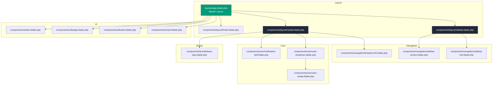

# Ebara Indonesia - Inventory Management System
## UI Layout/Theme Architecture Blueprint

---

## 1. Visual Identity & Brand Colors

### Ebara Theme Color Palette

| Color Name | Hex Value | Usage |
|------------|-----------|-------|
| **Primary (Ebara Teal)** | `#009B77` | Active states, primary buttons, header accents, active menu items |
| **Secondary (Dark Slate)** | `#1F2937` | Sidebar background, primary text |
| **Accent (Alert Red)** | `#EF4444` | Error messages, delete actions, logo accents |
| **Background (Light Grey)** | `#F3F4F6` | Main content area background |
| **Surface (White)** | `#FFFFFF` | Cards, modals, dropdown backgrounds |
| **Border (Grey)** | `#E5E7EB` | Dividers, borders |
| **Text (Dark)** | `#111827` | Headings, primary text |
| **Text (Muted)** | `#6B7280` | Secondary text, labels |
| **Hover (Light Teal)** | `#008065` | Hover states for primary elements |

---

## 2. File Tree Structure

```
resources/
├── views/
│   ├── layouts/
│   │   ├── app.blade.php              # Master layout skeleton (admin dashboard)
│   │   ├── guest.blade.php            # Guest layout (login, register) - existing
│   │   └── auth.blade.php             # Auth layout (optional, for auth pages)
│   │
│   ├── components/
│   │   ├── layout/
│   │   │   ├── sidebar.blade.php      # Collapsible sidebar with navigation
│   │   │   ├── navbar.blade.php       # Sticky top header
│   │   │   ├── footer.blade.php       # Simple copyright footer
│   │   │   └── mobile-menu.blade.php  # Mobile hamburger menu
│   │   │
│   │   ├── navigation/
│   │   │   ├── sidebar-link.blade.php # Reusable sidebar navigation link
│   │   │   ├── sidebar-section.blade.php # Sidebar section/group
│   │   │   ├── nav-item.blade.php     # Generic navigation item
│   │   │   └── breadcrumb.blade.php   # Breadcrumb navigation
│   │   │
│   │   ├── ui/
│   │   │   ├── card.blade.php         # Card container component
│   │   │   ├── button.blade.php       # Primary/secondary button
│   │   │   ├── badge.blade.php        # Status badge
│   │   │   ├── alert.blade.php        # Alert/notification
│   │   │   ├── modal.blade.php        # Modal dialog (existing)
│   │   │   ├── dropdown.blade.php     # Dropdown (existing)
│   │   │   └── table.blade.php        # Data table wrapper
│   │   │
│   │   ├── user/
│   │   │   ├── user-avatar.blade.php  # User profile avatar
│   │   │   ├── user-dropdown.blade.php # User profile dropdown
│   │   │   └── notification-bell.blade.php # Notification icon with badge
│   │   │
│   │   ├── brand/
│   │   │   ├── ebara-logo.blade.php   # Ebara company logo
│   │   │   └── app-name.blade.php     # Application name
│   │   │
│   │   └── [existing components...]
│   │
│   ├── dashboard/
│   │   ├── index.blade.php            # Dashboard overview
│   │   └── partials/
│   │       ├── stats-card.blade.php   # Statistics card
│   │       └── recent-activity.blade.php
│   │
│   ├── products/
│   │   ├── index.blade.php            # Products list
│   │   ├── create.blade.php           # Create product
│   │   ├── edit.blade.php             # Edit product
│   │   └── show.blade.php             # Product details
│   │
│   ├── inventory/
│   │   ├── stock-in.blade.php         # Stock in form
│   │   ├── stock-out.blade.php        # Stock out form
│   │   └── history.blade.php          # Stock movement history
│   │
│   ├── reports/
│   │   ├── inventory.blade.php        # Inventory report
│   │   └── transactions.blade.php     # Transaction report
│   │
│   └── settings/
│       ├── index.blade.php            # Settings page
│       └── profile.blade.php          # User profile

app/
└── View/
    └── Components/
        ├── Layout/
        │   ├── AppLayout.php          # Admin layout component class
        │   ├── Sidebar.php             # Sidebar component class
        │   ├── Navbar.php              # Navbar component class
        │   └── Footer.php              # Footer component class
        │
        ├── Navigation/
        │   ├── SidebarLink.php         # Sidebar link component class
        │   ├── SidebarSection.php      # Sidebar section component class
        │   └── Breadcrumb.php          # Breadcrumb component class
        │
        ├── Ui/
        │   ├── Card.php                # Card component class
        │   ├── Button.php              # Button component class
        │   ├── Badge.php               # Badge component class
        │   ├── Alert.php               # Alert component class
        │   └── Table.php               # Table component class
        │
        └── User/
            ├── UserAvatar.php          # User avatar component class
            ├── UserDropdown.php        # User dropdown component class
            └── NotificationBell.php    # Notification bell component class

tailwind.config.js                      # Tailwind configuration with Ebara theme
resources/css/app.css                   # Main CSS file
resources/js/app.js                     # Main JavaScript file (Alpine.js integration)
```

---

## 3. Tailwind Configuration Blueprint

### tailwind.config.js - Ebara Theme Configuration

```javascript
import defaultTheme from 'tailwindcss/defaultTheme';
import forms from '@tailwindcss/forms';

/** @type {import('tailwindcss').Config} */
export default {
    content: [
        './vendor/laravel/framework/src/Illuminate/Pagination/resources/views/*.blade.php',
        './storage/framework/views/*.php',
        './resources/views/**/*.blade.php',
    ],

    darkMode: 'class', // Enable dark mode via class

    theme: {
        extend: {
            // Ebara Brand Colors
            colors: {
                // Primary - Ebara Teal
                ebara: {
                    50: '#E6F7F3',
                    100: '#CCEEDB',
                    200: '#9FE2C3',
                    300: '#70D7AB',
                    400: '#41CC93',
                    500: '#009B77', // Primary brand color
                    600: '#008065', // Hover state
                    700: '#006653',
                    800: '#004C40',
                    900: '#00332D',
                    950: '#001A16',
                },
                
                // Secondary - Dark Slate
                slate: {
                    850: '#1A202C',
                    900: '#111827',
                    950: '#0B0F19',
                },
                
                // Background colors
                bg: {
                    primary: '#F3F4F6',   // Main content background
                    secondary: '#FFFFFF',  // Card/surface background
                    dark: '#1F2937',       // Sidebar background
                },
                
                // Text colors
                text: {
                    primary: '#111827',    // Primary text
                    secondary: '#6B7280',  // Secondary/muted text
                    light: '#9CA3AF',      // Light text
                },
            },

            // Typography - Inter Font
            fontFamily: {
                sans: ['Inter', ...defaultTheme.fontFamily.sans],
                mono: ['JetBrains Mono', ...defaultTheme.fontFamily.mono],
            },

            // Border radius for modern look
            borderRadius: {
                '4xl': '2rem',
            },

            // Box shadows
            boxShadow: {
                'ebara': '0 4px 6px -1px rgba(0, 155, 119, 0.1), 0 2px 4px -1px rgba(0, 155, 119, 0.06)',
                'ebara-lg': '0 10px 15px -3px rgba(0, 155, 119, 0.1), 0 4px 6px -2px rgba(0, 155, 119, 0.05)',
                'sidebar': '4px 0 24px rgba(0, 0, 0, 0.1)',
            },

            // Transitions
            transitionProperty: {
                'height': 'height',
                'spacing': 'margin, padding',
            },

            // Spacing
            spacing: {
                '4.5': '1.125rem',
                '5.5': '1.375rem',
                '13': '3.25rem',
                '15': '3.75rem',
                '17': '4.25rem',
                '18': '4.5rem',
                '21': '5.25rem',
                '22': '5.5rem',
                '25': '6.25rem',
                '26': '6.5rem',
                '28': '7rem',
                '72': '18rem',
                '80': '20rem',
                '84': '21rem',
                '96': '24rem',
            },

            // Z-index layers
            zIndex: {
                '60': '60',
                '70': '70',
                '80': '80',
                '90': '90',
                '100': '100',
            },

            // Animation
            animation: {
                'fade-in': 'fadeIn 0.3s ease-in-out',
                'slide-in': 'slideIn 0.3s ease-out',
                'slide-out': 'slideOut 0.3s ease-in',
            },
            keyframes: {
                fadeIn: {
                    '0%': { opacity: '0' },
                    '100%': { opacity: '1' },
                },
                slideIn: {
                    '0%': { transform: 'translateX(-100%)' },
                    '100%': { transform: 'translateX(0)' },
                },
                slideOut: {
                    '0%': { transform: 'translateX(0)' },
                    '100%': { transform: 'translateX(-100%)' },
                },
            },
        },
    },

    plugins: [
        forms,
        // Add @tailwindcss/typography for content styling if needed
    ],
};
```

---

## 4. Master Layout Blueprint (app.blade.php)

### Grid System & Layout Structure

```blade
<!DOCTYPE html>
<html lang="{{ str_replace('_', '-', app()->getLocale()) }}" class="h-full">
<head>
    <meta charset="utf-8">
    <meta name="viewport" content="width=device-width, initial-scale=1">
    <meta name="csrf-token" content="{{ csrf_token() }}">
    <title>{{ config('app.name', 'Ebara Inventory') }} - {{ $page_title ?? 'Dashboard' }}</title>
    
    <!-- Fonts: Inter via Google Fonts -->
    <link rel="preconnect" href="https://fonts.googleapis.com">
    <link rel="preconnect" href="https://fonts.gstatic.com" crossorigin>
    <link href="https://fonts.googleapis.com/css2?family=Inter:wght@300;400;500;600;700&display=swap" rel="stylesheet">
    
    <!-- Icons: Phosphor Icons -->
    <script src="https://unpkg.com/@phosphor-icons/web"></script>
    
    <!-- Vite Assets -->
    @vite(['resources/css/app.css', 'resources/js/app.js'])
</head>

<body class="font-sans antialiased text-text-primary bg-bg-primary h-full overflow-hidden">
    
    <!-- Main Container: Full viewport height, flex layout -->
    <div class="flex h-screen w-full bg-bg-primary" x-data="{ 
        sidebarOpen: @js(session('sidebar_open', true)),
        mobileSidebarOpen: false 
    }">
        
        <!-- ==================== SIDEBAR ==================== -->
        <!-- 
           - Fixed width on desktop (w-72 = 18rem)
           - Collapsible via Alpine.js state
           - Dark background (bg-slate-900)
           - Scrollable content (overflow-y-auto)
        -->
        <aside 
            x-transition:enter="transition-transform duration-300 ease-in-out"
            x-transition:enter-start="-translate-x-full"
            x-transition:enter-end="translate-x-0"
            x-transition:leave="transition-transform duration-300 ease-in-out"
            x-transition:leave-start="translate-x-0"
            x-transition:leave-end="-translate-x-full"
            class="fixed inset-y-0 left-0 z-50 w-72 bg-slate-900 text-white shadow-sidebar
                   lg:static lg:inset-auto lg:translate-x-0
                   lg:transition-all lg:duration-300 lg:ease-in-out
                   {{ $sidebarOpen ? 'lg:w-72' : 'lg:w-20' }}
                   {{ $mobileSidebarOpen ? 'translate-x-0' : '-translate-x-full lg:translate-x-0' }}"
        >
            <x-layout.sidebar :collapsed="!$sidebarOpen" />
        </aside>
        
        <!-- Mobile Sidebar Overlay -->
        <div 
            x-show="$mobileSidebarOpen"
            x-transition:enter="transition-opacity duration-300"
            x-transition:enter-start="opacity-0"
            x-transition:enter-end="opacity-100"
            x-transition:leave="transition-opacity duration-300"
            x-transition:leave-start="opacity-100"
            x-transition:leave-end="opacity-0"
            @click="$mobileSidebarOpen = false"
            class="fixed inset-0 z-40 bg-black/50 lg:hidden"
            style="display: none;"
        ></div>
        
        <!-- ==================== MAIN CONTENT WRAPPER ==================== -->
        <!-- 
           - Flex column layout
           - Full height minus sidebar
           - Overflow handling
        -->
        <div class="flex flex-1 flex-col h-screen overflow-hidden">
            
            <!-- ==================== NAVBAR ==================== -->
            <!-- 
               - Sticky top header
               - White background
               - Shadow for depth
               - Contains: Logo (mobile), Search, Notifications, User Profile
            -->
            <header class="sticky top-0 z-30 bg-white border-b border-gray-200 shadow-sm">
                <x-layout.navbar 
                    :sidebar-open="$sidebarOpen"
                    @toggle-sidebar="$sidebarOpen = !$sidebarOpen"
                    @toggle-mobile-sidebar="$mobileSidebarOpen = !$mobileSidebarOpen"
                />
            </header>
            
            <!-- ==================== PAGE CONTENT ==================== -->
            <!-- 
               - Scrollable main content area
               - Padding for content
               - Breadcrumb + Page Heading + Slot
            -->
            <main class="flex-1 overflow-y-auto bg-bg-primary p-4 sm:p-6 lg:p-8">
                
                <!-- Breadcrumb Navigation (Optional) -->
                @if(isset($breadcrumb))
                    <x-navigation.breadcrumb :items="$breadcrumb" />
                @endif
                
                <!-- Page Heading -->
                @isset($header)
                    <div class="mb-6">
                        <h1 class="text-2xl font-bold text-text-primary">{{ $header }}</h1>
                        @isset($description)
                            <p class="mt-1 text-sm text-text-secondary">{{ $description }}</p>
                        @endisset
                    </div>
                @endisset
                
                <!-- Page Content Slot -->
                <div class="animate-fade-in">
                    {{ $slot }}
                </div>
                
            </main>
            
            <!-- ==================== FOOTER ==================== -->
            <!-- 
               - Simple copyright footer
               - Fixed at bottom or within content flow
            -->
            <footer class="bg-white border-t border-gray-200 py-4">
                <x-layout.footer />
            </footer>
            
        </div>
        
    </div>
    
    <!-- Flash Messages Container -->
    <div id="flash-messages" class="fixed top-20 right-4 z-50 space-y-2">
        @foreach(['success', 'error', 'warning', 'info'] as $type)
            @if(session()->has($type))
                <x-ui.alert :type="$type" :message="session()->get($type)" />
            @endif
        @endforeach
    </div>
    
</body>
</html>
```

---

## 5. Sidebar Component Blueprint

### components/layout/sidebar.blade.php

```blade
@props([
    'collapsed' => false,
    'navigation' => null
])

@php
    // Default navigation menu structure
    $menu = $navigation ?? [
        [
            'title' => 'Dashboard',
            'icon' => 'ph-squares-four',
            'route' => 'dashboard',
            'active' => request()->routeIs('dashboard'),
        ],
        [
            'title' => 'Products',
            'icon' => 'ph-package',
            'route' => 'products.index',
            'active' => request()->routeIs('products*'),
        ],
        [
            'title' => 'Inventory',
            'icon' => 'ph-warehouse',
            'children' => [
                [
                    'title' => 'Stock In',
                    'route' => 'inventory.stock-in',
                    'active' => request()->routeIs('inventory.stock-in'),
                ],
                [
                    'title' => 'Stock Out',
                    'route' => 'inventory.stock-out',
                    'active' => request()->routeIs('inventory.stock-out'),
                ],
                [
                    'title' => 'History',
                    'route' => 'inventory.history',
                    'active' => request()->routeIs('inventory.history'),
                ],
            ],
        ],
        [
            'title' => 'Reports',
            'icon' => 'ph-chart-bar',
            'children' => [
                [
                    'title' => 'Inventory Report',
                    'route' => 'reports.inventory',
                    'active' => request()->routeIs('reports.inventory'),
                ],
                [
                    'title' => 'Transactions',
                    'route' => 'reports.transactions',
                    'active' => request()->routeIs('reports.transactions'),
                ],
            ],
        ],
        [
            'title' => 'Settings',
            'icon' => 'ph-gear',
            'children' => [
                [
                    'title' => 'Profile',
                    'route' => 'profile.edit',
                    'active' => request()->routeIs('profile.edit'),
                ],
                [
                    'title' => 'System Settings',
                    'route' => 'settings.index',
                    'active' => request()->routeIs('settings*'),
                ],
            ],
        ],
    ];
@endphp

<!-- Sidebar Container -->
<div class="flex flex-col h-full">
    
    <!-- Logo Section -->
    <div class="flex items-center justify-between h-16 px-4 border-b border-slate-700">
        <a href="{{ route('dashboard') }}" class="flex items-center space-x-3 overflow-hidden">
            <!-- Ebara Logo -->
            <div class="flex-shrink-0">
                <x-brand.ebara-logo class="h-8 w-8 text-ebara-500" />
            </div>
            <!-- App Name (hidden when collapsed) -->
            <span class="text-lg font-semibold text-white whitespace-nowrap transition-opacity duration-300 {{ $collapsed ? 'opacity-0 w-0' : 'opacity-100' }}">
                Ebara IMS
            </span>
        </a>
    </div>
    
    <!-- Navigation Menu -->
    <nav class="flex-1 overflow-y-auto py-4 px-3 space-y-1">
        @foreach($menu as $item)
            @if(isset($item['children']))
                <!-- Menu Group with Children -->
                <x-navigation.sidebar-section 
                    :title="$item['title']" 
                    :icon="$item['icon'] ?? null"
                    :collapsed="$collapsed"
                    :children="$item['children']"
                />
            @else
                <!-- Single Menu Item -->
                <x-navigation.sidebar-link 
                    :title="$item['title']"
                    :icon="$item['icon'] ?? null"
                    :route="$item['route']"
                    :active="$item['active'] ?? false"
                    :collapsed="$collapsed"
                />
            @endif
        @endforeach
    </nav>
    
    <!-- User Info (Bottom Sidebar) -->
    <div class="border-t border-slate-700 p-4">
        <div class="flex items-center space-x-3">
            <div class="flex-shrink-0">
                <x-user.user-avatar :user="Auth::user()" class="h-10 w-10" />
            </div>
            <div class="flex-1 min-w-0 overflow-hidden transition-opacity duration-300 {{ $collapsed ? 'opacity-0 w-0' : 'opacity-100' }}">
                <p class="text-sm font-medium text-white truncate">{{ Auth::user()->name }}</p>
                <p class="text-xs text-slate-400 truncate">{{ Auth::user()->email }}</p>
            </div>
        </div>
    </div>
    
</div>
```

---

## 6. Navbar Component Blueprint

### components/layout/navbar.blade.php

```blade
@props([
    'sidebarOpen' => true,
])

<div class="flex items-center justify-between h-16 px-4 sm:px-6">
    
    <!-- Left Section: Hamburger + Breadcrumb -->
    <div class="flex items-center space-x-4">
        
        <!-- Sidebar Toggle Button (Desktop) -->
        <button 
            @click="$dispatch('toggle-sidebar')"
            class="hidden lg:flex p-2 rounded-lg text-gray-500 hover:bg-gray-100 hover:text-gray-700 transition-colors"
        >
            <i class="ph ph-list text-xl"></i>
        </button>
        
        <!-- Mobile Menu Button -->
        <button 
            @click="$dispatch('toggle-mobile-sidebar')"
            class="lg:hidden p-2 rounded-lg text-gray-500 hover:bg-gray-100 hover:text-gray-700 transition-colors"
        >
            <i class="ph ph-list text-xl"></i>
        </button>
        
        <!-- Mobile Logo -->
        <div class="lg:hidden flex items-center space-x-2">
            <x-brand.ebara-logo class="h-8 w-8 text-ebara-500" />
            <span class="text-lg font-semibold text-gray-900">Ebara IMS</span>
        </div>
        
        <!-- Breadcrumb (Desktop) -->
        <nav class="hidden lg:flex" aria-label="Breadcrumb">
            <ol class="flex items-center space-x-2 text-sm">
                <li>
                    <a href="{{ route('dashboard') }}" class="text-gray-500 hover:text-ebara-500 transition-colors">
                        <i class="ph ph-house"></i>
                    </a>
                </li>
                @if(request()->route()->getName() !== 'dashboard')
                    <li class="text-gray-300">
                        <i class="ph ph-caret-right"></i>
                    </li>
                    <li class="text-gray-700 font-medium">
                        {{ Str::title(str_replace('.', ' ', request()->route()->getName())) }}
                    </li>
                @endif
            </ol>
        </nav>
    </div>
    
    <!-- Center Section: Search (Desktop) -->
    <div class="hidden md:flex flex-1 max-w-lg mx-8">
        <div class="relative w-full">
            <div class="absolute inset-y-0 left-0 pl-3 flex items-center pointer-events-none">
                <i class="ph ph-magnifying-glass text-gray-400"></i>
            </div>
            <input 
                type="text" 
                placeholder="Search products, inventory..." 
                class="block w-full pl-10 pr-3 py-2 border border-gray-300 rounded-lg leading-5 bg-gray-50 placeholder-gray-400 focus:outline-none focus:bg-white focus:ring-2 focus:ring-ebara-500 focus:border-ebara-500 sm:text-sm transition-colors"
            >
        </div>
    </div>
    
    <!-- Right Section: Notifications + User Dropdown -->
    <div class="flex items-center space-x-3">
        
        <!-- Notifications -->
        <x-user.notification-bell :count="3" />
        
        <!-- User Profile Dropdown -->
        <x-user.user-dropdown />
        
    </div>
    
</div>
```

---

## 7. Footer Component Blueprint

### components/layout/footer.blade.php

```blade
<div class="container mx-auto px-4 sm:px-6 lg:px-8">
    <div class="flex flex-col sm:flex-row items-center justify-between space-y-2 sm:space-y-0">
        
        <!-- Copyright -->
        <p class="text-sm text-gray-500">
            &copy; {{ date('Y') }} Ebara Indonesia. All rights reserved.
        </p>
        
        <!-- Version -->
        <p class="text-sm text-gray-400">
            Inventory Management System v{{ config('app.version', '1.0.0') }}
        </p>
        
    </div>
</div>
```

---

## 8. Navigation Component Blueprints

### components/navigation/sidebar-link.blade.php

```blade
@props([
    'title',
    'icon' => null,
    'route',
    'active' => false,
    'collapsed' => false,
])

@php
    $baseClasses = 'flex items-center px-3 py-2.5 rounded-lg text-sm font-medium transition-all duration-200 group';
    $activeClasses = 'bg-ebara-500 text-white shadow-ebara';
    $inactiveClasses = 'text-slate-300 hover:bg-slate-800 hover:text-white';
    $classes = $active ? $activeClasses : $inactiveClasses;
@endphp

<a 
    href="{{ $route }}" 
    class="{{ $baseClasses }} {{ $classes }}"
    {{ $active ? 'aria-current="page"' : '' }}
>
    @if($icon)
        <i class="ph {{ $icon }} text-lg flex-shrink-0 {{ $collapsed ? 'mx-auto' : 'mr-3' }}"></i>
    @endif
    
    <span class="truncate {{ $collapsed ? 'hidden' : '' }}">{{ $title }}</span>
    
    @if($active)
        <span class="ml-auto w-1.5 h-1.5 rounded-full bg-white"></span>
    @endif
</a>
```

### components/navigation/sidebar-section.blade.php

```blade
@props([
    'title',
    'icon' => null,
    'collapsed' => false,
    'children' => [],
])

<div x-data="{ open: {{ request()->routeIs(collect($children)->pluck('active')->toArray()) ? 'true' : 'false' }} }">
    
    <!-- Section Header (Clickable) -->
    <button 
        @click="open = !open"
        class="w-full flex items-center px-3 py-2.5 rounded-lg text-sm font-medium text-slate-300 hover:bg-slate-800 hover:text-white transition-all duration-200 group"
    >
        @if($icon)
            <i class="ph {{ $icon }} text-lg flex-shrink-0 {{ $collapsed ? 'mx-auto' : 'mr-3' }}"></i>
        @endif
        
        <span class="flex-1 text-left truncate {{ $collapsed ? 'hidden' : '' }}">{{ $title }}</span>
        
        @if(!$collapsed)
            <i class="ph ph-caret-down transition-transform duration-200" :class="{ 'rotate-180': open }"></i>
        @endif
    </button>
    
    <!-- Children Menu (Collapsible) -->
    <div 
        x-show="open"
        x-collapse
        class="mt-1 space-y-1 {{ $collapsed ? 'hidden' : '' }}"
    >
        @foreach($children as $child)
            <a 
                href="{{ route($child['route']) }}"
                class="flex items-center px-3 py-2 rounded-lg text-sm font-medium transition-all duration-200 group
                       {{ $child['active'] ?? false 
                            ? 'bg-ebara-500/20 text-ebara-400' 
                            : 'text-slate-400 hover:bg-slate-800 hover:text-slate-200' }}"
            >
                <span class="w-6 h-6 flex items-center justify-center mr-3">
                    <span class="w-1.5 h-1.5 rounded-full {{ $child['active'] ?? false ? 'bg-ebara-400' : 'bg-slate-600 group-hover:bg-slate-400' }}"></span>
                </span>
                <span class="truncate">{{ $child['title'] }}</span>
            </a>
        @endforeach
    </div>
    
</div>
```

---

## 9. UI Component Blueprints

### components/ui/card.blade.php

```blade
@props([
    'title' => null,
    'description' => null,
    'padding' => 'default', // default, sm, lg, none
])

@php
    $paddingClasses = match($padding) {
        'sm' => 'p-4',
        'lg' => 'p-6',
        'none' => '',
        default => 'p-5',
    };
@endphp

<div class="bg-white rounded-xl shadow-sm border border-gray-200 {{ $paddingClasses }}">
    
    @if($title || $description)
        <div class="{{ $slot->isNotEmpty() ? 'mb-4' : '' }}">
            @if($title)
                <h3 class="text-lg font-semibold text-gray-900">{{ $title }}</h3>
            @endif
            @if($description)
                <p class="mt-1 text-sm text-gray-500">{{ $description }}</p>
            @endif
        </div>
    @endif
    
    {{ $slot }}
    
</div>
```

### components/ui/button.blade.php

```blade
@props([
    'variant' => 'primary', // primary, secondary, danger, ghost
    'size' => 'default', // sm, default, lg
    'type' => 'button',
])

@php
    $variantClasses = match($variant) {
        'primary' => 'bg-ebara-500 text-white hover:bg-ebara-600 focus:ring-ebara-500',
        'secondary' => 'bg-white text-gray-700 border border-gray-300 hover:bg-gray-50 focus:ring-gray-500',
        'danger' => 'bg-red-500 text-white hover:bg-red-600 focus:ring-red-500',
        'ghost' => 'bg-transparent text-gray-700 hover:bg-gray-100 focus:ring-gray-500',
        default => 'bg-ebara-500 text-white hover:bg-ebara-600 focus:ring-ebara-500',
    };
    
    $sizeClasses = match($size) {
        'sm' => 'px-3 py-1.5 text-xs',
        'lg' => 'px-6 py-3 text-base',
        default => 'px-4 py-2 text-sm',
    };
@endphp

<button 
    {{ $attributes->merge(['type' => $type, 'class' => "inline-flex items-center justify-center font-medium rounded-lg transition-colors focus:outline-none focus:ring-2 focus:ring-offset-2 disabled:opacity-50 disabled:cursor-not-allowed {$variantClasses} {$sizeClasses}"]) }}
>
    {{ $slot }}
</button>
```

### components/ui/badge.blade.php

```blade
@props([
    'variant' => 'default', // default, success, warning, danger, info
])

@php
    $variantClasses = match($variant) {
        'success' => 'bg-green-100 text-green-800',
        'warning' => 'bg-yellow-100 text-yellow-800',
        'danger' => 'bg-red-100 text-red-800',
        'info' => 'bg-blue-100 text-blue-800',
        default => 'bg-gray-100 text-gray-800',
    };
@endphp

<span {{ $attributes->merge(['class' => "inline-flex items-center px-2.5 py-0.5 rounded-full text-xs font-medium {$variantClasses}"]) }}>
    {{ $slot }}
</span>
```

---

## 10. User Component Blueprints

### components/user/user-dropdown.blade.php

```blade
<x-dropdown align="right" width="56">
    <x-slot name="trigger">
        <button class="flex items-center space-x-3 p-1 rounded-full hover:bg-gray-100 transition-colors focus:outline-none focus:ring-2 focus:ring-ebara-500">
            <x-user.user-avatar :user="Auth::user()" class="h-9 w-9" />
            <div class="hidden md:block text-left">
                <p class="text-sm font-medium text-gray-900">{{ Auth::user()->name }}</p>
                <p class="text-xs text-gray-500">{{ Auth::user()->role ?? 'User' }}</p>
            </div>
            <i class="ph ph-caret-down text-gray-400 hidden md:block"></i>
        </button>
    </x-slot>
    
    <x-slot name="content">
        <div class="px-4 py-3 border-b border-gray-100">
            <p class="text-sm font-medium text-gray-900">{{ Auth::user()->name }}</p>
            <p class="text-xs text-gray-500 mt-1">{{ Auth::user()->email }}</p>
        </div>
        
        <div class="py-1">
            <x-dropdown-link :href="route('profile.edit')">
                <i class="ph ph-user mr-2"></i> Profile
            </x-dropdown-link>
            <x-dropdown-link :href="route('settings.index')">
                <i class="ph ph-gear mr-2"></i> Settings
            </x-dropdown-link>
        </div>
        
        <div class="border-t border-gray-100 py-1">
            <form method="POST" action="{{ route('logout') }}">
                @csrf
                <x-dropdown-link 
                    :href="route('logout')"
                    onclick="event.preventDefault(); this.closest('form').submit();"
                    class="text-red-600 hover:bg-red-50"
                >
                    <i class="ph ph-sign-out mr-2"></i> Log Out
                </x-dropdown-link>
            </form>
        </div>
    </x-slot>
</x-dropdown>
```

### components/user/notification-bell.blade.php

```blade
@props(['count' => 0])

<button class="relative p-2 rounded-full text-gray-500 hover:bg-gray-100 hover:text-gray-700 transition-colors focus:outline-none focus:ring-2 focus:ring-ebara-500">
    <i class="ph ph-bell text-xl"></i>
    
    @if($count > 0)
        <span class="absolute top-1 right-1 flex h-4 w-4">
            <span class="animate-ping absolute inline-flex h-full w-full rounded-full bg-red-400 opacity-75"></span>
            <span class="relative inline-flex rounded-full h-4 w-4 bg-red-500 text-[10px] font-medium text-white items-center justify-center">
                {{ $count > 9 ? '9+' : $count }}
            </span>
        </span>
    @endif
</button>
```

### components/user/user-avatar.blade.php

```blade
@props(['user', 'size' => 'md'])

@php
    $sizeClasses = match($size) {
        'sm' => 'h-6 w-6 text-xs',
        'lg' => 'h-12 w-12 text-lg',
        default => 'h-9 w-9 text-sm',
    };
@endphp

<div class="{{ $sizeClasses }} rounded-full bg-ebara-100 text-ebara-600 flex items-center justify-center font-medium">
    {{ strtoupper(substr($user->name, 0, 1)) }}
</div>
```

---

## 11. Brand Component Blueprints

### components/brand/ebara-logo.blade.php

```blade
@props(['class' => 'h-8 w-8'])

<svg 
    {{ $attributes->merge(['class' => $class]) }} 
    viewBox="0 0 100 100" 
    fill="none" 
    xmlns="http://www.w3.org/2000/svg"
>
    <!-- Ebara-style Logo (simplified representation) -->
    <circle cx="50" cy="50" r="45" fill="#009B77" fill-opacity="0.1"/>
    <path d="M50 15 L85 50 L50 85 L15 50 Z" fill="#009B77"/>
    <path d="M50 25 L75 50 L50 75 L25 50 Z" fill="white"/>
    <circle cx="50" cy="50" r="10" fill="#009B77"/>
</svg>
```

---

## 12. Responsive Design Strategy

### Breakpoint Strategy

| Breakpoint | Width | Sidebar Behavior | Navbar Behavior |
|------------|-------|------------------|-----------------|
| **Mobile** | < 640px | Hidden (off-canvas) | Hamburger menu, simplified |
| **Tablet** | 640px - 1024px | Hidden (off-canvas) | Full navbar, search visible |
| **Desktop** | > 1024px | Fixed left, collapsible | Full navbar with all features |

### Mobile Sidebar Behavior

1. **Default State**: Hidden off-screen (`-translate-x-full`)
2. **Active State**: Slides in from left (`translate-x-0`)
3. **Overlay**: Semi-transparent backdrop when open
4. **Close Actions**: Click outside, close button, or navigation item click

### Desktop Sidebar Behavior

1. **Default State**: Fixed width 288px (`w-72`)
2. **Collapsed State**: Reduced width 80px (`w-20`)
3. **Transition**: Smooth 300ms ease-in-out
4. **Content**: Icons remain visible, text hidden when collapsed

---

## 13. Alpine.js Integration Points

### State Management

```javascript
// Global state for layout
{
    sidebarOpen: true,           // Desktop sidebar toggle
    mobileSidebarOpen: false,    // Mobile sidebar visibility
    notificationsOpen: false,     // Notifications dropdown
    userDropdownOpen: false,     // User profile dropdown
}
```

### Event Dispatching

```blade
<!-- Sidebar Toggle (Desktop) -->
<button @click="$dispatch('toggle-sidebar')">

<!-- Mobile Sidebar Toggle -->
<button @click="$dispatch('toggle-mobile-sidebar')">

<!-- Listen for events in parent -->
<div x-data="{ sidebarOpen: true }" @toggle-sidebar.window="sidebarOpen = !sidebarOpen">
```

---

## 14. Accessibility Considerations

### ARIA Labels & Roles

- `aria-label` for icon-only buttons
- `aria-current="page"` for active navigation
- `aria-expanded` for collapsible sections
- `role="navigation"` for nav elements
- `role="button"` for interactive elements

### Keyboard Navigation

- Tab order: Logo → Sidebar → Search → Notifications → User → Content
- Focus states visible on all interactive elements
- Escape key closes dropdowns and modals

### Color Contrast

- All text meets WCAG AA contrast ratio (4.5:1)
- Interactive elements have clear hover/focus states
- Color not used as sole indicator of state

---

## 15. Performance Considerations

### Asset Optimization

1. **Fonts**: Use `font-display: swap` for Inter font
2. **Icons**: Use Phosphor Icons via CDN (lightweight)
3. **Images**: Lazy load images in content
4. **CSS**: Purge unused Tailwind classes in production

### JavaScript

- Alpine.js for lightweight reactivity
- No heavy frameworks (React/Vue) needed
- Debounce search input
- Lazy load sidebar content if needed

---

## 16. Implementation Priority

### Phase 1: Core Layout (Foundation)
1. Update `tailwind.config.js` with Ebara colors
2. Create `layouts/app.blade.php` master layout
3. Create `components/layout/sidebar.blade.php`
4. Create `components/layout/navbar.blade.php`
5. Create `components/layout/footer.blade.php`

### Phase 2: Navigation Components
6. Create `components/navigation/sidebar-link.blade.php`
7. Create `components/navigation/sidebar-section.blade.php`
8. Create `components/navigation/breadcrumb.blade.php`

### Phase 3: UI Components
9. Create `components/ui/card.blade.php`
10. Create `components/ui/button.blade.php`
11. Create `components/ui/badge.blade.php`
12. Create `components/ui/alert.blade.php`

### Phase 4: User Components
13. Create `components/user/user-dropdown.blade.php`
14. Create `components/user/notification-bell.blade.php`
15. Create `components/user/user-avatar.blade.php`

### Phase 5: Brand Components
16. Create `components/brand/ebara-logo.blade.php`

---

## 17. Testing Checklist

### Visual Testing
- [ ] Color palette matches Ebara brand
- [ ] Typography renders correctly with Inter font
- [ ] Icons display properly
- [ ] Shadows and borders render correctly

### Responsive Testing
- [ ] Mobile (320px - 640px)
- [ ] Tablet (641px - 1024px)
- [ ] Desktop (1025px+)
- [ ] Sidebar toggle works on desktop
- [ ] Mobile menu opens/closes correctly

### Interaction Testing
- [ ] Navigation links work
- [ ] Dropdowns open/close
- [ ] Sidebar collapse/expand
- [ ] Hover states visible
- [ ] Focus states visible

### Accessibility Testing
- [ ] Keyboard navigation works
- [ ] Screen reader compatible
- [ ] Color contrast meets WCAG AA
- [ ] ARIA labels present

---

## 18. Next Steps

After this blueprint is approved:

1. **Switch to Code Mode** to implement the components
2. **Create PHP Component Classes** for each Blade component
3. **Update Routes** for navigation structure
4. **Create Sample Views** to test the layout
5. **Add JavaScript** for sidebar state persistence
6. **Test Responsiveness** across devices

---

## 19. Architecture Diagram



---

## 20. Grid System Visual Reference

```
┌─────────────────────────────────────────────────────────────────┐
│                         NAVBAR (sticky)                        │
│  [☰] [Logo] [Search──────────────] [🔔] [User ▼]              │
├──────────┬──────────────────────────────────────────────────────┤
│          │                                                      │
│  SIDEBAR │                   MAIN CONTENT                       │
│  (fixed) │               (scrollable)                          │
│          │                                                      │
│  ┌────┐  │  ┌──────────────────────────────────────────────┐  │
│  │Logo│  │  │ Breadcrumb: Home > Products > List           │  │
│  └────┘  │  ├──────────────────────────────────────────────┤  │
│          │  │ Page Heading: Products                        │  │
│  ┌──────┐ │  │ Description: Manage your inventory products  │  │
│  │Dash  │ │  ├──────────────────────────────────────────────┤  │
│  ├──────┤ │  │                                              │  │
│  │Prod  │ │  │  ┌─────────┐  ┌─────────┐  ┌─────────┐     │  │
│  ├──────┤ │  │  │ Card 1  │  │ Card 2  │  │ Card 3  │     │  │
│  │Inv   │ │  │  └─────────┘  └─────────┘  └─────────┘     │  │
│  ├──────┤ │  │                                              │  │
│  │Reps  │ │  │  ┌──────────────────────────────────────┐ │  │
│  ├──────┤ │  │  │         Data Table                     │ │  │
│  │Sett  │ │  │  └──────────────────────────────────────┘ │  │
│  └──────┘ │  │                                              │  │
│          │  │                                              │  │
│          │  └──────────────────────────────────────────────┘  │
│          │                                                      │
├──────────┴──────────────────────────────────────────────────────┤
│                         FOOTER                                   │
│  © 2026 Ebara Indonesia • Inventory Management System v1.0.0    │
└─────────────────────────────────────────────────────────────────┘

Sidebar: w-72 (288px) or w-20 (80px) when collapsed
Navbar: h-16 (64px)
Footer: Auto height
```

---

**Document Version:** 1.0  
**Last Updated:** 2026-01-12  
**Author:** Senior Laravel Architect & UI/UX Designer
