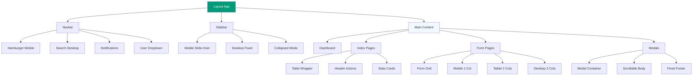

# Rencana Responsif 100% - Laravel Inventory Management System

## Ringkasan Eksekutif

Dokumen ini merinci rencana implementasi responsif 100% untuk sistem manajemen inventaris Laravel Ebara, memastikan tampilan optimal di iPhone SE (Mobile), iPad (Tablet), dan 4K Desktop.

---

## Analisis Saat Ini

### Status Terkini
| Komponen | Status Responsif | Catatan |
|----------|-----------------|---------|
| [`layouts/app.blade.php`](../resources/views/layouts/app.blade.php) | ⚠️ 80% | Sidebar toggle ada, tapi perlu perbaikan mobile interaction |
| [`components/layout/sidebar.blade.php`](../resources/views/components/layout/sidebar.blade.php) | ⚠️ 70% | Ada Alpine.js, tapi transisi mobile perlu diperbaiki |
| [`components/layout/navbar.blade.php`](../resources/views/components/layout/navbar.blade.php) | ✅ 90% | Hampir optimal, perlu minor adjustments |
| [`dashboard.blade.php`](../resources/views/dashboard.blade.php) | ✅ 95% | Sudah sangat responsif |
| `asset_materials/index.blade.php` | ⚠️ 60% | Table tidak punya overflow wrapper |
| `asset_tools/index.blade.php` | ⚠️ 60% | Table tidak punya overflow wrapper |
| `asset_models/index.blade.php` | ⚠️ 60% | Table tidak punya overflow wrapper |
| `roles/index.blade.php` | ⚠️ 70% | Table punya overflow, tapi modal perlu perbaikan |
| `reports/index.blade.php` | ⚠️ 70% | Table punya overflow, tapi filter buttons perlu stacking |
| `reports/create.blade.php` | ⚠️ 65% | Form grids perlu perbaikan mobile |

### Masalah Utama Teridentifikasi

1. **Tabel Tanpa Overflow Wrapper**: Materials, Tools, Models index pages
2. **Modal Tidak Responsif**: Modal form tidak punya `w-full mx-4` dan `max-h-[80vh]`
3. **DataTables Controls**: Length/filter controls tidak stacking dengan benar di mobile
4. **Form Grids**: Beberapa form menggunakan grid fixed yang tidak responsif
5. **Chart Legends**: Legend charts tidak reposition ke bottom di mobile
6. **Action Buttons**: Tombol aksi tidak stacking vertikal di mobile

---

## Standar Arsitektur Responsif

### 1. Navigasi (Layouts/App)

#### Mobile (< 1024px)
```blade
<!-- Sidebar: Hidden by default, slide-over off-canvas -->
<aside 
    :class="mobileSidebarOpen ? 'translate-x-0' : '-translate-x-full'"
    class="fixed inset-y-0 left-0 z-50 w-72 bg-slate-900 lg:hidden transition-transform"
>
    <!-- Menu items -->
</aside>

<!-- Overlay/Backdrop -->
<div 
    x-show="mobileSidebarOpen" 
    @click="mobileSidebarOpen = false"
    class="fixed inset-0 bg-black/50 z-40 lg:hidden"
></div>

<!-- Navbar: Hamburger button left-aligned -->
<header class="h-16 flex items-center px-4">
    <button @click="mobileSidebarOpen = true" class="lg:hidden">
        <i class="ph ph-list text-2xl"></i>
    </button>
</header>
```

#### Desktop (>= 1024px)
```blade
<!-- Sidebar: Fixed/Sticky on left -->
<aside class="lg:static lg:inset-auto w-72">
    <!-- Menu items -->
</aside>

<!-- Hamburger button: Hidden -->
<button class="hidden lg:block">
    <!-- Desktop sidebar collapse toggle -->
</button>

<!-- Main content: Left margin for sidebar -->
<main class="flex-1 lg:ml-72">
    <!-- Content -->
</main>
```

### 2. Data Tables (Universal Table Component)

#### Struktur Tabel Responsif
```blade
<div class="bg-white shadow-lg rounded-xl border border-gray-100 p-6">
    <!-- Table Wrapper with Overflow -->
    <div class="overflow-x-auto">
        <table id="dataTable" class="w-full min-w-[600px]">
            <thead>
                <tr class="bg-gray-100 text-gray-600 uppercase text-sm">
                    <!-- Headers -->
                </tr>
            </thead>
            <tbody>
                <!-- Data rows -->
            </tbody>
        </table>
    </div>
</div>
```

#### DataTables Controls Responsif
```javascript
dom: '<"flex flex-col sm:flex-row justify-between items-center gap-4 mb-4"lf>rt<"flex flex-col sm:flex-row justify-between items-center gap-4 mt-4"ip>'
```

#### Kolom Responsif (Opsional - Hide pada Mobile)
```blade
<th class="px-4 py-3 text-left font-semibold hidden sm:table-cell">Supplier</th>
<th class="px-4 py-3 text-left font-semibold hidden md:table-cell">Lokasi</th>
```

### 3. Forms (Universal Form Layout)

#### Grid System Responsif
```blade
<form class="space-y-4">
    <!-- Single Column: Mobile -->
    <div class="grid grid-cols-1 gap-4">
        <!-- Inputs stack vertically -->
    </div>

    <!-- Two Columns: Tablet -->
    <div class="grid grid-cols-1 md:grid-cols-2 gap-4">
        <!-- Inputs: 2 columns on tablet+ -->
    </div>

    <!-- Three Columns: Desktop -->
    <div class="grid grid-cols-1 md:grid-cols-2 lg:grid-cols-3 gap-4">
        <!-- Inputs: 3 columns on desktop -->
    </div>
</form>
```

#### Input Styles
```blade
<input 
    type="text" 
    class="w-full rounded-lg border-gray-300 shadow-sm border p-2.5 focus:ring-2 focus:ring-ebara-500 focus:border-transparent transition"
>
```

### 4. Modals (Universal Modal Component)

#### Struktur Modal Responsif
```blade
<div id="modal" class="fixed inset-0 bg-gray-900/50 z-50 overflow-y-auto">
    <div class="flex items-center justify-center min-h-screen p-4">
        <div class="relative bg-white rounded-xl shadow-2xl w-full mx-4 sm:mx-auto sm:max-w-2xl flex flex-col max-h-[90vh]">
            
            <!-- Header: Fixed height -->
            <div class="flex justify-between items-center p-6 border-b border-gray-200 flex-shrink-0">
                <h3 class="text-lg font-semibold text-gray-900">Modal Title</h3>
                <button @click="closeModal()">
                    <i class="ph ph-x text-2xl"></i>
                </button>
            </div>

            <!-- Body: Scrollable -->
            <div class="p-6 overflow-y-auto flex-1">
                <!-- Form content -->
            </div>

            <!-- Footer: Fixed height -->
            <div class="flex justify-end gap-3 p-6 border-t border-gray-200 flex-shrink-0">
                <button type="button" class="bg-gray-200 hover:bg-gray-300 text-gray-800 font-medium py-2 px-4 rounded-lg transition">
                    Batal
                </button>
                <button type="submit" class="bg-ebara-600 hover:bg-ebara-700 text-white font-medium py-2 px-4 rounded-lg transition">
                    Simpan
                </button>
            </div>

        </div>
    </div>
</div>
```

### 5. Charts (Dashboard)

#### Chart Container Responsif
```blade
<div class="relative w-full overflow-hidden min-h-[300px]">
    <div id="chart" class="w-full h-[300px]"></div>
</div>
```

#### Legend Position (Mobile: Bottom)
```javascript
const chartOptions = {
    legend: {
        position: window.innerWidth < 768 ? 'bottom' : 'top',
        labels: { colors: colors.secondary }
    },
    // ... other options
};
```

---

## Rencana Implementasi

### Fase 1: Layout & Navigasi (Foundation)

#### 1.1 Refactor [`layouts/app.blade.php`](../resources/views/layouts/app.blade.php)
- [ ] Pastikan sidebar menggunakan Alpine.js `mobileSidebarOpen` state
- [ ] Sidebar mobile: `fixed inset-y-0 left-0 z-50 w-72` dengan `translate-x-full` default
- [ ] Sidebar desktop: `lg:static lg:inset-auto`
- [ ] Overlay mobile: `fixed inset-0 bg-black/50 z-40 lg:hidden`
- [ ] Navbar hamburger: `lg:hidden` untuk mobile, `hidden lg:block` untuk desktop toggle
- [ ] Main content: `flex-1` tanpa margin di mobile, `lg:ml-72` di desktop

#### 1.2 Refactor [`components/layout/sidebar.blade.php`](../resources/views/components/layout/sidebar.blade.php)
- [ ] Pastikan semua menu items menggunakan `x-show` untuk sidebar collapse state
- [ ] Icon-only mode untuk collapsed sidebar di desktop
- [ ] User info section responsive

#### 1.3 Refactor [`components/layout/navbar.blade.php`](../resources/views/components/layout/navbar.blade.php)
- [ ] Hamburger button mobile: `lg:hidden`
- [ ] Desktop toggle button: `hidden lg:block`
- [ ] Breadcrumb: `hidden lg:flex`
- [ ] Search bar: `hidden md:flex`
- [ ] Notification bell & user dropdown: Always visible

### Fase 2: Index Pages (Tables)

#### 2.1 Universal Table Snippet
Buat file [`resources/views/components/ui/data-table-wrapper.blade.php`](../resources/views/components/ui/data-table-wrapper.blade.php):

```blade
@props(['tableId' => 'dataTable', 'minWidth' => '600px'])

<div class="bg-white shadow-lg rounded-xl border border-gray-100 p-6">
    <div class="overflow-x-auto">
        <table id="{{ $tableId }}" class="w-full min-w-[{{ $minWidth }]]">
            {{ $slot }}
        </table>
    </div>
</div>
```

#### 2.2 Apply ke Semua Index Pages
- [ ] [`asset_materials/index.blade.php`](../resources/views/asset_materials/index.blade.php)
- [ ] [`asset_tools/index.blade.php`](../resources/views/asset_tools/index.blade.php)
- [ ] [`asset_models/index.blade.php`](../resources/views/asset_models/index.blade.php)
- [ ] [`roles/index.blade.php`](../resources/views/roles/index.blade.php)
- [ ] [`reports/index.blade.php`](../resources/views/reports/index.blade.php)

**Perubahan yang diperlukan:**
1. Bungkus `<table>` dengan `<div class="overflow-x-auto">`
2. Tambahkan `min-w-[600px]` ke class table
3. Pastikan DataTables dom config menggunakan flex responsive
4. Header actions: `flex-col sm:flex-row sm:space-y-0`

#### 2.3 Kolom Responsif (Opsional)
Untuk tabel dengan banyak kolom, sembunyikan kolom kurang penting di mobile:
```blade
<th class="hidden sm:table-cell">Supplier</th>
<th class="hidden md:table-cell">Location</th>
```

### Fase 3: Form Pages

#### 3.1 Universal Form Snippet
Buat file [`resources/views/components/ui/form-grid.blade.php`](../resources/views/components/ui/form-grid.blade.php):

```blade
@props(['columns' => '1'])

<div class="grid grid-cols-1 {{ $columns === '2' ? 'md:grid-cols-2' : '' }} {{ $columns === '3' ? 'md:grid-cols-2 lg:grid-cols-3' : '' }} gap-4">
    {{ $slot }}
</div>
```

#### 3.2 Apply ke Semua Form Pages
- [ ] [`reports/create.blade.php`](../resources/views/reports/create.blade.php)
- [ ] Modal forms di semua index pages

**Perubahan yang diperlukan:**
1. Ganti `grid-cols-2` dengan `grid-cols-1 md:grid-cols-2`
2. Ganti `grid-cols-4` dengan `grid-cols-2 md:grid-cols-4`
3. Pastikan semua inputs menggunakan `w-full`

### Fase 4: Modals

#### 4.1 Universal Modal Snippet
Buat file [`resources/views/components/ui/responsive-modal.blade.php`](../resources/views/components/ui/responsive-modal.blade.php):

```blade
@props(['id' => 'modal', 'title' => 'Modal Title', 'maxWidth' => 'lg'])

<div id="{{ $id }}" class="fixed inset-0 bg-gray-900/50 z-50 overflow-y-auto hidden">
    <div class="flex items-center justify-center min-h-screen p-4">
        <div class="relative bg-white rounded-xl shadow-2xl w-full mx-4 sm:mx-auto sm:max-w-{{ $maxWidth === 'lg' ? '2xl' : '4xl' }} flex flex-col max-h-[90vh]">
            
            <!-- Header -->
            <div class="flex justify-between items-center p-6 border-b border-gray-200 flex-shrink-0">
                <h3 class="text-lg font-semibold text-gray-900">{{ $title }}</h3>
                <button @click="document.getElementById('{{ $id }}').classList.add('hidden')">
                    <i class="ph ph-x text-2xl"></i>
                </button>
            </div>

            <!-- Body -->
            <div class="p-6 overflow-y-auto flex-1">
                {{ $slot }}
            </div>

            <!-- Footer -->
            <div class="flex flex-col sm:flex-row justify-end gap-3 p-6 border-t border-gray-200 flex-shrink-0">
                <button type="button" class="bg-gray-200 hover:bg-gray-300 text-gray-800 font-medium py-2 px-4 rounded-lg transition">
                    Batal
                </button>
                <button type="submit" class="bg-ebara-600 hover:bg-ebara-700 text-white font-medium py-2 px-4 rounded-lg transition">
                    Simpan
                </button>
            </div>

        </div>
    </div>
</div>
```

#### 4.2 Apply ke Semua Modals
- [ ] [`asset_materials/index.blade.php`](../resources/views/asset_materials/index.blade.php) - Material Modal
- [ ] [`asset_tools/index.blade.php`](../resources/views/asset_tools/index.blade.php) - Tool Modal
- [ ] [`asset_models/index.blade.php`](../resources/views/asset_models/index.blade.php) - Model Modal
- [ ] [`roles/index.blade.php`](../resources/views/roles/index.blade.php) - Role Modal

### Fase 5: Charts (Dashboard)

#### 5.1 Chart Container Responsive
Pastikan semua chart containers memiliki:
- `w-full` untuk full width
- `min-h-[300px]` untuk minimum height
- `overflow-hidden` untuk prevent overflow

#### 5.2 Legend Position Mobile
Update semua chart options untuk reposition legend di mobile:
```javascript
const chartOptions = {
    legend: {
        position: window.innerWidth < 768 ? 'bottom' : 'top',
        labels: { colors: colors.secondary }
    },
    // ... other options
};

// Update on resize
window.addEventListener('resize', function() {
    chart.updateOptions({
        legend: {
            position: window.innerWidth < 768 ? 'bottom' : 'top'
        }
    });
});
```

### Fase 6: Header Actions & Filter Buttons

#### 6.1 Header Actions Responsive
```blade
<div class="flex flex-col sm:flex-row sm:items-center sm:justify-between gap-4">
    <div>
        <h1 class="text-2xl font-bold text-gray-900">Page Title</h1>
        <p class="text-gray-600 mt-1">Description</p>
    </div>
    <div class="flex flex-col sm:flex-row gap-3">
        <!-- Action buttons -->
    </div>
</div>
```

#### 6.2 Filter Buttons Responsive
```blade
<div class="flex flex-wrap gap-2">
    <button class="px-4 py-2 rounded-lg text-sm font-medium bg-ebara-600 text-white transition">
        Semua
    </button>
    <!-- More buttons -->
</div>
```

---

## Deliverables

### 1. Layout Files
- [x] [`layouts/app.blade.php`](../resources/views/layouts/app.blade.php) - Refactored
- [x] [`components/layout/sidebar.blade.php`](../resources/views/components/layout/sidebar.blade.php) - Refactored
- [x] [`components/layout/navbar.blade.php`](../resources/views/components/layout/navbar.blade.php) - Refactored

### 2. New Component Files
- [ ] [`resources/views/components/ui/data-table-wrapper.blade.php`](../resources/views/components/ui/data-table-wrapper.blade.php)
- [ ] [`resources/views/components/ui/form-grid.blade.php`](../resources/views/components/ui/form-grid.blade.php)
- [ ] [`resources/views/components/ui/responsive-modal.blade.php`](../resources/views/components/ui/responsive-modal.blade.php)

### 3. Updated Index Pages
- [ ] [`asset_materials/index.blade.php`](../resources/views/asset_materials/index.blade.php)
- [ ] [`asset_tools/index.blade.php`](../resources/views/asset_tools/index.blade.php)
- [ ] [`asset_models/index.blade.php`](../resources/views/asset_models/index.blade.php)
- [ ] [`roles/index.blade.php`](../resources/views/roles/index.blade.php)
- [ ] [`reports/index.blade.php`](../resources/views/reports/index.blade.php)

### 4. Updated Form Pages
- [ ] [`reports/create.blade.php`](../resources/views/reports/create.blade.php)
- [ ] Modal forms dalam index pages

### 5. Updated Dashboard
- [ ] [`dashboard.blade.php`](../resources/views/dashboard.blade.php) - Chart legend positioning

---

## Testing Checklist

### Mobile (iPhone SE - 375px)
- [ ] Sidebar hidden by default
- [ ] Hamburger button visible and functional
- [ ] Sidebar slides in with overlay
- [ ] Tables scroll horizontally (no body scroll)
- [ ] Modals full width with proper padding
- [ ] Form inputs stack vertically
- [ ] Charts have minimum height
- [ ] Chart legends at bottom

### Tablet (iPad - 768px)
- [ ] Sidebar visible (optional toggle)
- [ ] Tables scroll horizontally if needed
- [ ] Modals centered with max-width
- [ ] Form inputs 2 columns
- [ ] Charts proper sizing

### Desktop (1920px+)
- [ ] Sidebar fixed on left
- [ ] Hamburger button hidden
- [ ] Tables full width
- [ ] Modals centered with max-width
- [ ] Form inputs 2-3 columns
- [ ] Charts full width

---

## Diagram Arsitektur



---

## Catatan Implementasi

### Breakpoint Tailwind CSS
- `sm`: 640px (Small phones, landscape phones)
- `md`: 768px (Tablets)
- `lg`: 1024px (Small laptops, large tablets)
- `xl`: 1280px (Desktops)
- `2xl`: 1536px (Large desktops)

### Alpine.js State Management
```javascript
x-data="{ 
    sidebarOpen: true, 
    mobileSidebarOpen: false 
}"
```

### DataTables Responsive Config
```javascript
dom: '<"flex flex-col sm:flex-row justify-between items-center gap-4 mb-4"lf>rt<"flex flex-col sm:flex-row justify-between items-center gap-4 mt-4"ip>'
```

---

## Prioritas Implementasi

| Fase | Prioritas | Estimasi Complexity |
|------|-----------|---------------------|
| Fase 1: Layout & Navigasi | 🔴 Critical | Tinggi |
| Fase 2: Index Pages | 🔴 Critical | Sedang |
| Fase 3: Form Pages | 🟡 High | Rendah |
| Fase 4: Modals | 🟡 High | Sedang |
| Fase 5: Charts | 🟢 Medium | Rendah |
| Fase 6: Header Actions | 🟢 Medium | Rendah |

---

## Catatan Tambahan

1. **Performance**: Gunakan `will-change` dan `transform` untuk animasi smooth
2. **Accessibility**: Pastikan keyboard navigation works di mobile
3. **Touch Targets**: Minimum 44x44px untuk touch-friendly buttons
4. **Viewport Meta**: Sudah ada di `<head>` layout
5. **Testing**: Test di Chrome DevTools Device Mode + real devices

---

**Dokumen ini disiapkan oleh:**
- Mode: 🏗️ Architect
- Tanggal: 2026-01-19
- Project: Ebara Inventory Management System
