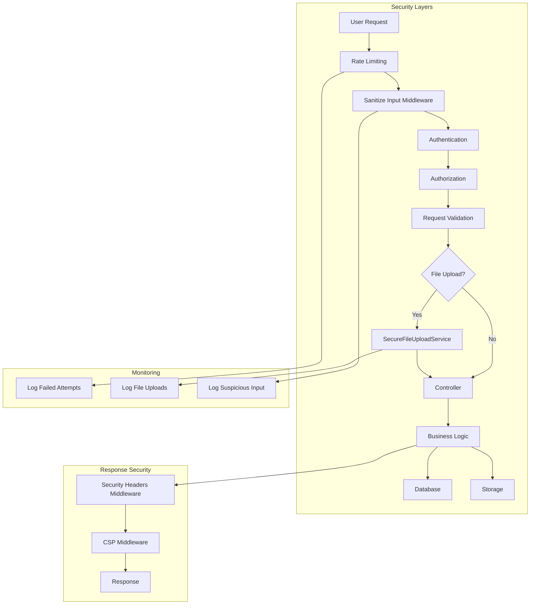

# Laravel Inventory Management System - Security Hardening Plan

## Executive Summary

Dokumen ini berisi rencana komprehensif untuk memperkuat keamanan Laravel Inventory Management System terhadap OWASP Top 10 dan ancaman khusus seperti "Judol" Injection (defacement/spam), Remote Code Execution (RCE), dan Data Breach.

---

## Threat Model Analysis

### 1. "Judol" Injection (Defacement/Spam)
- **Deskripsi**: Penyerang menyuntikkan iklan judi atau skrip berbahaya ke dalam views atau database
- **Vektor Utama**: XSS melalui input yang tidak disanitasi, file SVG berisi script berbahaya, SQL Injection
- **Dampak**: Defacement website, spam konten, kehilangan reputasi

### 2. Remote Code Execution (RCE)
- **Deskripsi**: Penyerang mengunggah PHP shell (backdoor) untuk mengambil kontrol server
- **Vektor Utama**: File upload yang tidak divalidasi dengan benar, deserialization yang tidak aman
- **Dampak**: Kompromi penuh server, akses ke data sensitif, kerugian finansial

### 3. Data Breach
- **Deskripsi**: Akses tidak sah ke data sensitif
- **Vektor Utama**: SQL Injection, session hijacking, weak authentication
- **Dampak**: Kebocoran data pelanggan, kerugian finansial, isu legal

---

## Current State Analysis

### Temuan Kerentanan

| Area | Status | Risiko | Catatan |
|------|--------|--------|---------|
| File Upload Validation | ❌ Tidak ada | **KRITIS** | Tidak ada validasi file upload di Request classes |
| Input Sanitization | ❌ Tidak ada | **TINGGI** | Tidak ada middleware sanitasi input global |
| Rate Limiting (Login) | ⚠️ Sebagian | **SEDANG** | Hanya pada email verification |
| Session Security | ⚠️ Sebagian | **SEDANG** | SESSION_SECURE_COOKIE tidak diset |
| Password Policy | ❌ Tidak ada | **TINGGI** | Tidak ada kebijakan password yang kuat |
| Security Headers | ❌ Tidak ada | **SEDANG** | Tidak ada CSP atau security headers |
| App Debug Mode | ⚠️ Default | **TINGGI** | APP_DEBUG=true di .env.example |
| XSS Protection | ✅ Baik | **RENDAH** | Blade menggunakan {{ }} secara default |
| File Storage | ✅ Baik | **RENDAH** | Menggunakan storage/app/public |

---

## Implementation Plan

### FASE 1: File Upload Security (Prioritas KRITIS)

#### 1.1 Buat Secure File Upload Service
**File**: `app/Services/SecureFileUploadService.php`

**Fitur**:
- Validasi MIME type menggunakan `finfo_file()` (server-side, bukan dari browser)
- Whitelist ekstensi file yang ketat: `jpg, jpeg, png, pdf, webp`
- Blacklist ekstensi berbahaya: `php, php5, php7, phtml, html, htm, svg, js, exe, sh, pl, cgi`
- Validasi ukuran file (max 5MB)
- Deteksi double extension (misal: `image.php.jpg`)
- Force rename file menggunakan hash (SHA-256 dengan timestamp)
- Scan file content untuk mendeteksi script tersembunyi
- Validasi dimensi gambar untuk file gambar

**Mengapa mencegah RCE/Judol**:
- Validasi MIME type server-side mencegah bypass browser
- Whitelist ekstensi memblokir PHP shell dan script berbahaya
- Renaming dengan hash mencegah eksekusi script melalui nama file yang dapat diprediksi
- Deteksi double extension mencegah bypass validasi

#### 1.2 Update Request Validation Classes
**Files**:
- `app/Http/Requests/StoreAssetMaterialRequest.php`
- `app/Http/Requests/StoreAssetToolRequest.php`
- `app/Http/Requests/StoreAssetModelRequest.php`

**Perubahan**:
- Tambahkan validasi file upload dengan aturan ketat
- Gunakan custom validation rule untuk file upload

#### 1.3 Update Asset Services
**Files**:
- `app/Services/AssetMaterialService.php`
- `app/Services/AssetToolService.php`
- `app/Services/AssetModelService.php`

**Perubahan**:
- Integrasikan SecureFileUploadService
- Hapus file lama saat update
- Validasi file sebelum penyimpanan

---

### FASE 2: Input Sanitization (Anti-XSS & SQLi)

#### 2.1 Buat Global Input Sanitization Middleware
**File**: `app/Http/Middleware/SanitizeInputMiddleware.php`

**Fitur**:
- Sanitasi semua input request secara otomatis
- Strip tags untuk field non-rich-text
- Encode HTML entities untuk mencegah XSS
- Validasi SQL injection patterns (basic)
- Bypass untuk field yang memerlukan HTML (jika ada)

**Mengapa mencegah Judol Injection**:
- Mencegah penyuntikan script `<script>` ke dalam database
- Mencegah XSS yang dapat digunakan untuk defacement
- Sanitasi input membantu mencegah SQL Injection

#### 2.2 Update Bootstrap App
**File**: `bootstrap/app.php`

**Perubahan**:
- Register SanitizeInputMiddleware secara global

#### 2.3 Install HTML Purifier (Opsional)
**Package**: `mews/purifier`

**Fitur**:
- Untuk field yang memerlukan rich text
- Strip script tags dan elemen berbahaya
- Whitelist tag HTML yang aman

---

### FASE 3: Authentication & Session Hardening

#### 3.1 Implement Rate Limiting
**File**: `routes/auth.php`

**Perubahan**:
- Tambahkan `throttle:5,1` pada route login (5 percobaan per menit)
- Tambahkan `throttle:5,1` pada route register
- Tambahkan `throttle:3,1` pada route password reset

**Mengapa mencegah Brute Force**:
- Mencegah serangan brute force pada login
- Mengurangi risiko credential stuffing

#### 3.2 Update Session Configuration
**Files**:
- `.env` (production)
- `config/session.php`

**Perubahan**:
```env
SESSION_SECURE_COOKIE=true
SESSION_HTTP_ONLY=true
SESSION_SAME_SITE=strict
SESSION_ENCRYPT=true
```

**Mengapa mencegah Session Hijacking**:
- Secure cookie hanya dikirim via HTTPS
- Http-only mencegah akses JavaScript ke cookie
- Same-site strict mencegah CSRF

#### 3.3 Implement Strong Password Policy
**File**: `app/Providers/AppServiceProvider.php`

**Perubahan**:
- Set default password rules di `Password::defaults()`
- Minimum 12 karakter
- Wajib mixed case (huruf besar dan kecil)
- Wajib angka
- Wajib simbol khusus

---

### FASE 4: Server Headers (CSP & HSTS)

#### 4.1 Buat Security Headers Middleware
**File**: `app/Http/Middleware/SecurityHeadersMiddleware.php`

**Headers yang ditambahkan**:
```
X-Frame-Options: DENY
X-Content-Type-Options: nosniff
X-XSS-Protection: 1; mode=block
Referrer-Policy: same-origin
Permissions-Policy: geolocation=(), microphone=(), camera=()
Strict-Transport-Security: max-age=31536000; includeSubDomains
```

**Mengapa mencegah Judol Scripts**:
- X-Frame-Options mencegah clickjacking
- X-Content-Type-Options mencegah MIME sniffing yang bisa dieksploitasi
- CSP akan memblokir script dari domain eksternal (Judol biasanya load JS dari domain luar)

#### 4.2 Install & Configure Laravel CSP
**Package**: `spatie/laravel-csp`

**Konfigurasi**:
- Whitelist domain yang aman untuk script
- Block semua script inline
- Block eval() dan unsafe-eval
- Block semua external stylesheets kecuali yang di-whitelist

**Mengapa mencegah Judol Injection**:
- Mencegah loading script dari domain judi
- Mencegah inline script injection
- Memvalidasi semua resource yang dimuat

#### 4.3 Update Bootstrap App
**File**: `bootstrap/app.php`

**Perubahan**:
- Register SecurityHeadersMiddleware
- Register CSP middleware

---

### FASE 5: Application Configuration

#### 5.1 Production Environment Variables
**File**: `.env` (production)

**Variabel yang harus diubah**:
```env
APP_ENV=production
APP_DEBUG=false
APP_KEY=<generate new key>
SESSION_SECURE_COOKIE=true
SESSION_HTTP_ONLY=true
SESSION_SAME_SITE=strict
SESSION_ENCRYPT=true
```

**Mengapa penting**:
- APP_DEBUG=false mencegah exposure stack trace
- APP_KEY baru mencegah session hijacking dari key yang bocor

#### 5.2 Folder Permissions
**Perintah**:
```bash
# Directories
find /path/to/project -type d -exec chmod 755 {} \;

# Files
find /path/to/project -type f -exec chmod 644 {} \;

# Storage dan cache
chmod -R 775 storage bootstrap/cache

# Public index.php
chmod 644 public/index.php
```

**Mengapa penting**:
- Mencegah penulisan file berbahaya ke direktori yang tidak seharusnya
- Mencegah eksekusi script di direktori publik

#### 5.3 Disable Directory Listing
**File**: `public/.htaccess` (Apache) atau Nginx config

**Perubahan**:
```apache
Options -Indexes
```

---

### FASE 6: Additional Security Measures

#### 6.1 CORS Configuration
**File**: `config/cors.php`

**Perubahan**:
- Restrict origins ke domain yang diizinkan
- Disable credentials untuk cross-origin requests

#### 6.2 SQL Injection Prevention
**Best Practices**:
- Gunakan Eloquent ORM (sudah dilakukan)
- Gunakan parameter binding (sudah dilakukan)
- Hindari raw SQL queries
- Validasi semua input

#### 6.3 Logging & Monitoring
**Implementasi**:
- Log semua login attempts
- Log semua file uploads
- Log suspicious activities
- Monitor failed login attempts

#### 6.4 Backup Security
**Best Practices**:
- Encrypt backup files
- Store backups off-site
- Limit access to backup files

---

## Deliverables

### 1. Code Snippet: SecureFileUploadService

```php
<?php

namespace App\Services;

use Illuminate\Http\UploadedFile;
use Illuminate\Support\Facades\Storage;
use Illuminate\Support\Str;
use finfo;

class SecureFileUploadService
{
    // Whitelist ekstensi file yang diizinkan
    private const ALLOWED_EXTENSIONS = ['jpg', 'jpeg', 'png', 'pdf', 'webp'];

    // Blacklist ekstensi file berbahaya
    private const BLOCKED_EXTENSIONS = [
        'php', 'php5', 'php7', 'phtml', 'html', 'htm', 'svg', 
        'js', 'exe', 'sh', 'pl', 'cgi', 'py', 'rb', 'jsp', 'asp'
    ];

    // MIME types yang diizinkan
    private const ALLOWED_MIME_TYPES = [
        'image/jpeg',
        'image/png',
        'image/webp',
        'application/pdf'
    ];

    // Maximum file size (5MB)
    private const MAX_FILE_SIZE = 5 * 1024 * 1024;

    /**
     * Upload file dengan validasi keamanan yang ketat
     */
    public function upload(UploadedFile $file, string $directory = 'uploads'): string
    {
        // 1. Validasi ukuran file
        $this->validateFileSize($file);

        // 2. Validasi ekstensi file
        $extension = $this->validateExtension($file);

        // 3. Validasi MIME type (server-side)
        $this->validateMimeType($file, $extension);

        // 4. Validasi double extension
        $this->validateDoubleExtension($file);

        // 5. Validasi konten file untuk script tersembunyi
        $this->validateFileContent($file);

        // 6. Validasi dimensi untuk file gambar
        if (in_array($extension, ['jpg', 'jpeg', 'png', 'webp'])) {
            $this->validateImageDimensions($file);
        }

        // 7. Generate nama file yang aman (hash + timestamp)
        $fileName = $this->generateSecureFileName($extension);

        // 8. Simpan file ke storage
        $path = $file->storeAs($directory, $fileName, 'public');

        return $path;
    }

    /**
     * Validasi ukuran file
     */
    private function validateFileSize(UploadedFile $file): void
    {
        if ($file->getSize() > self::MAX_FILE_SIZE) {
            throw new \InvalidArgumentException(
                'Ukuran file tidak boleh lebih dari ' . (self::MAX_FILE_SIZE / 1024 / 1024) . 'MB'
            );
        }
    }

    /**
     * Validasi ekstensi file
     */
    private function validateExtension(UploadedFile $file): string
    {
        $extension = strtolower($file->getClientOriginalExtension());

        // Cek ekstensi yang diblokir
        if (in_array($extension, self::BLOCKED_EXTENSIONS)) {
            throw new \InvalidArgumentException('Ekstensi file tidak diizinkan');
        }

        // Cek ekstensi yang diizinkan
        if (!in_array($extension, self::ALLOWED_EXTENSIONS)) {
            throw new \InvalidArgumentException('Hanya file ' . implode(', ', self::ALLOWED_EXTENSIONS) . ' yang diizinkan');
        }

        return $extension;
    }

    /**
     * Validasi MIME type menggunakan server-side detection
     */
    private function validateMimeType(UploadedFile $file, string $extension): void
    {
        $finfo = new finfo(FILEINFO_MIME_TYPE);
        $mimeType = $finfo->file($file->getRealPath());

        if (!in_array($mimeType, self::ALLOWED_MIME_TYPES)) {
            throw new \InvalidArgumentException('Tipe file tidak valid');
        }

        // Cross-check MIME type dengan ekstensi
        $expectedMimeTypes = [
            'jpg' => 'image/jpeg',
            'jpeg' => 'image/jpeg',
            'png' => 'image/png',
            'webp' => 'image/webp',
            'pdf' => 'application/pdf'
        ];

        if (isset($expectedMimeTypes[$extension]) && $expectedMimeTypes[$extension] !== $mimeType) {
            throw new \InvalidArgumentException('MIME type tidak sesuai dengan ekstensi file');
        }
    }

    /**
     * Validasi double extension (misal: image.php.jpg)
     */
    private function validateDoubleExtension(UploadedFile $file): void
    {
        $fileName = $file->getClientOriginalName();
        $parts = explode('.', $fileName);

        if (count($parts) > 2) {
            throw new \InvalidArgumentException('Nama file tidak valid');
        }
    }

    /**
     * Validasi konten file untuk mendeteksi script tersembunyi
     */
    private function validateFileContent(UploadedFile $file): void
    {
        $content = file_get_contents($file->getRealPath());

        // Cek untuk PHP tags
        if (preg_match('/<\?php|<\?|<\?=/i', $content)) {
            throw new \InvalidArgumentException('File mengandung script PHP');
        }

        // Cek untuk script tags
        if (preg_match('/<script[^>]*>.*?<\/script>/is', $content)) {
            throw new \InvalidArgumentException('File mengandung script tags');
        }

        // Cek untuk iframe tags
        if (preg_match('/<iframe[^>]*>.*?<\/iframe>/is', $content)) {
            throw new \InvalidArgumentException('File mengandung iframe tags');
        }

        // Cek untuk javascript: protocol
        if (preg_match('/javascript:/i', $content)) {
            throw new \InvalidArgumentException('File mengandung javascript protocol');
        }

        // Cek untuk data URI dengan script
        if (preg_match('/data:[^;]*;base64.*<script/is', $content)) {
            throw new \InvalidArgumentException('File mengandung data URI script');
        }
    }

    /**
     * Validasi dimensi gambar
     */
    private function validateImageDimensions(UploadedFile $file): void
    {
        $imageInfo = getimagesize($file->getRealPath());

        if ($imageInfo === false) {
            throw new \InvalidArgumentException('File bukan gambar yang valid');
        }

        // Validasi dimensi maksimal (misal: 5000x5000)
        $maxDimension = 5000;
        if ($imageInfo[0] > $maxDimension || $imageInfo[1] > $maxDimension) {
            throw new \InvalidArgumentException('Dimensi gambar terlalu besar');
        }

        // Validasi dimensi minimal (misal: 10x10)
        $minDimension = 10;
        if ($imageInfo[0] < $minDimension || $imageInfo[1] < $minDimension) {
            throw new \InvalidArgumentException('Dimensi gambar terlalu kecil');
        }
    }

    /**
     * Generate nama file yang aman menggunakan hash
     */
    private function generateSecureFileName(string $extension): string
    {
        $timestamp = time();
        $random = Str::random(16);
        $hash = hash('sha256', $timestamp . $random);

        return substr($hash, 0, 32) . '.' . $extension;
    }

    /**
     * Hapus file dari storage
     */
    public function delete(string $path): bool
    {
        if (Storage::disk('public')->exists($path)) {
            return Storage::disk('public')->delete($path);
        }

        return false;
    }
}
```

### 2. Code Snippet: SecurityHeadersMiddleware

```php
<?php

namespace App\Http\Middleware;

use Closure;
use Illuminate\Http\Request;

class SecurityHeadersMiddleware
{
    /**
     * List of security headers to be added
     */
    private const SECURITY_HEADERS = [
        'X-Frame-Options' => 'DENY',
        'X-Content-Type-Options' => 'nosniff',
        'X-XSS-Protection' => '1; mode=block',
        'Referrer-Policy' => 'same-origin',
        'Permissions-Policy' => 'geolocation=(), microphone=(), camera=()',
    ];

    /**
     * Handle an incoming request.
     */
    public function handle(Request $request, Closure $next)
    {
        $response = $next($request);

        // Add security headers
        foreach (self::SECURITY_HEADERS as $header => $value) {
            $response->headers->set($header, $value);
        }

        // Add HSTS header only in production with HTTPS
        if (config('app.env') === 'production' && $request->secure()) {
            $response->headers->set(
                'Strict-Transport-Security',
                'max-age=31536000; includeSubDomains; preload'
            );
        }

        // Remove server information
        $response->headers->remove('Server');
        $response->headers->remove('X-Powered-By');

        return $response;
    }
}
```

### 3. Checklist: Production Environment Variables

```env
# ============================================
# PRODUCTION ENVIRONMENT VARIABLES CHECKLIST
# ============================================

# --- Application ---
APP_ENV=production                    # ❌ Must be 'production'
APP_DEBUG=false                      # ❌ Must be 'false'
APP_URL=https://yourdomain.com       # ✅ Must use HTTPS
APP_KEY=<generate new key>           # ❌ Generate new key: php artisan key:generate

# --- Database ---
DB_CONNECTION=mysql
DB_HOST=127.0.0.1
DB_PORT=3306
DB_DATABASE=production_db            # ✅ Use separate database
DB_USERNAME=production_user          # ✅ Use separate user with limited privileges
DB_PASSWORD=<strong_password>        # ❌ Use strong password

# --- Session Security ---
SESSION_DRIVER=database              # ✅ Database is recommended for production
SESSION_LIFETIME=120
SESSION_ENCRYPT=true                 # ❌ Must be 'true'
SESSION_PATH=/
SESSION_DOMAIN=null
SESSION_SECURE_COOKIE=true           # ❌ Must be 'true' (requires HTTPS)
SESSION_HTTP_ONLY=true               # ✅ Already true, keep it
SESSION_SAME_SITE=strict             # ❌ Change from 'lax' to 'strict'

# --- Cache ---
CACHE_STORE=redis                    # ✅ Redis is recommended for production
CACHE_PREFIX=

# --- Queue ---
QUEUE_CONNECTION=redis                # ✅ Redis is recommended for production

# --- Mail ---
MAIL_MAILER=smtp                     # ✅ Use real mail service
MAIL_HOST=smtp.provider.com
MAIL_PORT=587
MAIL_USERNAME=your_email@domain.com
MAIL_PASSWORD=<mail_password>
MAIL_ENCRYPTION=tls                  # ✅ Use TLS
MAIL_FROM_ADDRESS=noreply@yourdomain.com
MAIL_FROM_NAME="${APP_NAME}"

# --- Filesystem ---
FILESYSTEM_DISK=public               # ✅ Store files outside public directory

# --- Logging ---
LOG_CHANNEL=daily                    # ✅ Use daily logs for production
LOG_LEVEL=warning                    # ❌ Change from 'debug' to 'warning' or 'error'

# --- Security ---
# Add these custom variables if needed
CSP_ENABLED=true                     # ✅ Enable Content Security Policy
CSP_REPORT_ONLY=false               # ✅ Set to false for production
ALLOWED_ORIGINS=https://yourdomain.com  # ✅ Restrict CORS origins
```

---

## Architecture Diagram



---

## Implementation Priority Matrix

| Priority | Phase | Tasks | Estimated Impact |
|----------|-------|-------|------------------|
| 🔴 CRITICAL | 1 | File Upload Security | Mencegah RCE & Malware Upload |
| 🔴 CRITICAL | 2 | Input Sanitization | Mencegah XSS & SQL Injection |
| 🟠 HIGH | 3 | Authentication Hardening | Mencegah Brute Force |
| 🟠 HIGH | 5 | App Configuration | Mencegah Info Disclosure |
| 🟡 MEDIUM | 4 | Security Headers | Mencegah Clickjacking & XSS |
| 🟡 MEDIUM | 6 | Logging & Monitoring | Deteksi & Response |
| 🟢 LOW | 6 | CORS Configuration | Proteksi tambahan |

---

## Testing Strategy

### Security Testing Checklist

- [ ] Upload file dengan ekstensi `.php` → Harus ditolak
- [ ] Upload file dengan double extension → Harus ditolak
- [ ] Upload file dengan MIME type palsu → Harus ditolak
- [ ] Upload file berisi script PHP → Harus ditolak
- [ ] Upload file SVG berisi script → Harus ditolak
- [ ] Input dengan `<script>` tag → Harus disanitasi
- [ ] SQL injection attempt → Harus gagal
- [ ] Brute force login → Harus dibatasi
- [ ] XSS via URL parameter → Harus dicegah
- [ ] Session hijacking attempt → Harus dicegah
- [ ] CSP violation → Harus dilaporkan

---

## Maintenance & Monitoring

### Regular Security Tasks

1. **Weekly**:
   - Review security logs
   - Check for failed login attempts
   - Monitor file uploads

2. **Monthly**:
   - Update dependencies (`composer update`)
   - Review security advisories
   - Audit user permissions

3. **Quarterly**:
   - Security audit
   - Penetration testing
   - Review and rotate APP_KEY

4. **Annually**:
   - Full security assessment
   - Update security policies
   - Security training for team

---

## References

- [OWASP Top 10](https://owasp.org/www-project-top-ten/)
- [Laravel Security Documentation](https://laravel.com/docs/security)
- [CSP Evaluator](https://csp-evaluator.withgoogle.com/)
- [Content Security Policy Level 3](https://www.w3.org/TR/CSP3/)

---

## Conclusion

Rencana ini memberikan pendekatan berlapis (defense-in-depth) untuk mengamankan aplikasi terhadap ancaman yang diidentifikasi. Implementasi bertahap sesuai prioritas akan memastikan mitigasi risiko yang paling kritis ditangani terlebih dahulu.
